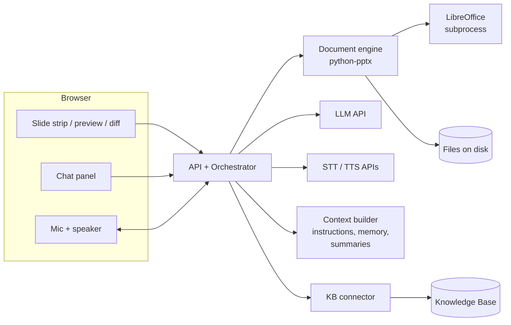
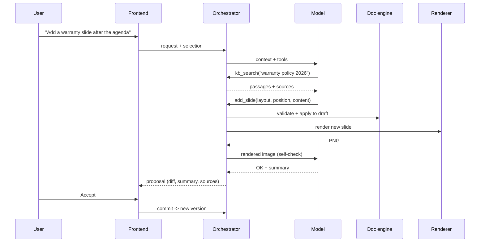

# AI Slide Assistant: Project Specification

**Version:** 0.5 (draft): file-based storage; LLM, STT and TTS consumed as services; authentication by nginx + OAuth2 Proxy

**Companion document:** *AI Slide Assistant: Technical Design* (implementation details, contracts, milestones). **Status:** For review

## 1. Purpose and scope

This document specifies a web application in which users load existing PowerPoint presentations, or start new ones, and modify them through a conversational AI assistant. Users speak or type requests in natural language ("make the title on slide 3 shorter", "add a slide comparing our two pricing tiers", "replace this photo with something from the product library"), and the assistant applies the changes to a real, editable .pptx file. Text, images, tables and layouts remain native PowerPoint objects, not rendered pictures.

The assistant uses a multi-modal language model consumed as a service. It supports speech-to-text (STT) for input and text-to-speech (TTS) for responses, and it can query an organizational Knowledge Base (KB) both to source domain-specific content for slides and to resolve ambiguous terms in user requests.

All work happens inside **Projects**. A project groups one or more slide decks, uploaded or created in the project, together with the assistant's conversations, the assistant's accumulated project knowledge, and project settings. Returning to a project restores everything, so the assistant continues where the user left off and can work across all of the project's decks.

### 1.1 Goals

The system shall let a non-technical user produce and revise a presentation without opening PowerPoint, while guaranteeing that the downloaded file opens cleanly in PowerPoint, Keynote, LibreOffice and Google Slides with all content editable. Every change made by the assistant shall be visible, reviewable and reversible. Work spanning days and several related decks shall not require the user to re-explain context to the assistant. Which model service is used shall be configuration, not code.

### 1.2 Non-goals for version 1

Version 1 does not cover real-time multi-user co-editing, slide animations and transitions authoring, video and audio embedding, SmartArt creation, or pixel-perfect in-browser rendering equal to PowerPoint's own engine. Existing elements of these kinds must be preserved untouched when a file is round-tripped (see section 6).

## 2. Users and key scenarios

The primary user is a knowledge worker (sales, consulting, training, internal communications) who produces decks frequently from recurring material. A secondary user is an administrator who configures the model endpoint, the Knowledge Base connection, brand templates and access rights.

The scenarios below drive the requirements and acceptance tests.

| ID | Scenario |
| --- | --- |
| S1 | A user uploads a 20-slide deck and says "tighten all the bullet points on slides 4 to 7, keep the meaning". The assistant shows proposed edits per slide; the user accepts three slides and rejects one. |
| S2 | A user asks "add a slide after the agenda summarising our 2026 warranty policy". The assistant searches the KB, drafts the slide with a citation in the speaker notes, and asks which layout to use because the template has two candidates. |
| S3 | A user, hands busy, says by voice "make the chart title bigger and read me what's on the next slide". The assistant edits, then reads slide content aloud via TTS. |
| S4 | A user asks "update the SLA numbers". The term "SLA numbers" matches three KB documents; the assistant asks a clarifying question listing the options before editing. |
| S5 | A user uploads a photo and says "put this on slide 2 instead of the stock image, and write alt text for it". |
| S6 | A user starts from a blank brand template and dictates an outline; the assistant creates eight slides from it. |
| S7 | A user says "undo the last two changes", then downloads the final .pptx. |
| S8 | A user creates a project "Client X proposal", uploads last year's proposal deck and a capabilities deck, and asks "build a new proposal deck reusing the case-study slides from the capabilities deck". The assistant creates a third deck in the project and copies the slides, adapting them to the new deck's template. |
| S9 | A user returns to the project two days later and says "continue with the pricing section we discussed". The assistant recalls the earlier decisions (e.g. "prices in EUR, no discounts shown") without the user repeating them. |
| S10 | A user tells the assistant "in this project, always call the product 'Atlas Platform', never 'Atlas'". The assistant stores this as a project instruction, shows it in the project's memory panel, and applies it in all decks and later conversations. |

## 3. Functional requirements

Priority uses MoSCoW: **M** must, **S** should, **C** could.

### 3.1 Presentation management

| ID | Requirement | Pri |
| --- | --- | --- |
| PM-1 | Upload .pptx files into a project, up to a configurable size (default 100 MB). Reject .pptm and other macro-enabled formats with a clear message. | M |
| PM-2 | Create a new presentation within a project from an administrator-provided template (.pptx or .potx) or from a default blank template. | M |
| PM-3 | Display a thumbnail strip of all slides and a large preview of the selected slide. | M |
| PM-4 | Download the current version as .pptx. | M |
| PM-5 | Export the current version as PDF. | S |
| PM-6 | Keep a version history per presentation; every accepted assistant change or manual edit produces a new version. Users can view and restore any version. | M |
| PM-7 | Allow simple manual edits without the assistant: edit text in place, reorder slides by drag-and-drop, delete slides. | S |
| PM-8 | Persist presentations as part of their project (see 3.6); a presentation always belongs to exactly one project. | M |

### 3.2 Natural-language editing

| ID | Requirement | Pri |
| --- | --- | --- |
| NL-1 | Accept requests that edit existing content: rewrite, shorten, expand, translate, change tone, fix grammar, at the level of a shape, a slide, a range of slides or the whole deck. | M |
| NL-2 | Accept structural requests: add, duplicate, delete and move slides; change a slide's layout; add, remove or resize shapes. | M |
| NL-3 | Accept formatting requests within the template's constraints: font size, bold/italic, color from the theme palette, alignment, bullet levels. | M |
| NL-4 | Accept table requests: create a table from described or KB data, add/remove rows and columns, edit cells. | S |
| NL-5 | Accept native chart requests (bar, line, pie) from supplied data, producing editable PowerPoint charts. | C |
| NL-6 | Resolve references in context: "this slide" (the selected slide), "the title", "the image on the left", "the slide about pricing", "what you just added". | M |
| NL-7 | Write and edit speaker notes. | M |
| NL-8 | Before applying any change that affects more than one slide or deletes content, show a plan and wait for confirmation. Single-shape edits may apply directly to a pending draft (see NL-9). | M |
| NL-9 | Present every change as a pending proposal with a before/after preview. The user accepts or rejects per slide or all at once. Nothing changes the saved version until accepted. | M |
| NL-10 | Support undo and redo of accepted changes by voice, text or button. | M |
| NL-11 | When a request is ambiguous, unsupported or would break the template, ask a single focused clarifying question or explain the limitation, rather than guessing. | M |
| NL-12 | Generate a full deck or a run of slides from an outline, a document or a KB topic. | S |

### 3.3 Images

| ID | Requirement | Pri |
| --- | --- | --- |
| IM-1 | Insert images uploaded by the user (PNG, JPEG, SVG converted to PNG, WebP converted to PNG) into a picture placeholder or at a specified position. | M |
| IM-2 | Replace an existing image while preserving its position, size and crop box, scaling to fit by default. | M |
| IM-3 | Insert images retrieved from the Knowledge Base or an administrator-approved asset library. | S |
| IM-4 | Use the model's vision capability to describe existing images, so requests like "the slide with the factory photo" resolve correctly. | M |
| IM-5 | Generate alt text for images on request and offer it automatically for images without alt text. | S |
| IM-6 | Generate new images with a configured image-generation model. Disabled unless an endpoint is configured. | C |

### 3.4 Voice

| ID | Requirement | Pri |
| --- | --- | --- |
| VO-1 | Push-to-talk microphone button and a keyboard shortcut; the live transcript appears in the input box and can be corrected before sending. | M |
| VO-2 | Optional hands-free mode with voice-activity detection and an explicit on/off indicator. | S |
| VO-3 | TTS playback of assistant responses, toggleable per user; long responses are summarised for speech while the full text stays on screen. | M |
| VO-4 | Barge-in: speaking or pressing the mic button stops current TTS playback. | S |
| VO-5 | Support at least English plus the languages configured by the administrator for both STT and TTS. | M |
| VO-6 | Voice commands for confirmation ("yes, apply it", "reject slide five") map to the same actions as the buttons. | S |

### 3.5 Knowledge Base integration

| ID | Requirement | Pri |
| --- | --- | --- |
| KB-1 | Search the KB with semantic and keyword queries, scoped by collection where configured. | M |
| KB-2 | Retrieve full documents or passages for use as slide content. | M |
| KB-3 | Record the source of KB-derived content (document title, ID, link) in the slide's speaker notes, and show sources in the chat. | M |
| KB-4 | Use the KB to disambiguate terms in requests (product names, acronyms, internal metrics) and ask the user when several matches remain. | M |
| KB-5 | Respect the user's KB access rights; the assistant never retrieves documents the user could not open directly. | M |
| KB-6 | Treat all KB content as data: instructions embedded in documents are never executed (see section 8). | M |

### 3.6 Projects and persistent assistant context

| ID | Requirement | Pri |
| --- | --- | --- |
| PJ-1 | Create, rename, archive and delete projects. A project has a name, an optional description, an owner and creation/modification dates. Deleting a project requires confirmation and removes its decks, conversations, memory and assets after a configurable grace period. | M |
| PJ-2 | A project contains zero or more decks. Users can upload decks into a project, create new decks in it (blank or from a template), duplicate a deck, rename it, and remove it. | M |
| PJ-3 | The project home lists its decks (thumbnail, title, slide count, last change), its conversations, and its assets. Users open a deck in the editor from there. | M |
| PJ-4 | A project can hold several conversations (threads). Conversations persist and are resumable at any time, with full history visible. Users can rename, start and delete conversations. | M |
| PJ-5 | Within a conversation, one deck is the **active deck** (the one open in the editor), which is the default target of requests. The user can switch the active deck by opening another deck or by naming it ("in the capabilities deck…"). | M |
| PJ-6 | The assistant can read any deck in the project and perform cross-deck operations: copy or move slides between decks, create a new deck from slides of existing decks, and apply a change consistently across several decks ("update the company logo in all decks"). Cross-deck changes follow the plan-and-confirm rule (NL-8). | M |
| PJ-7 | When slides are copied between decks with different templates, the assistant maps them onto the target deck's layouts and theme by default, reporting any content that could not be mapped; the user can choose to keep the source formatting instead. | S |
| PJ-8 | **Project instructions:** free-text guidance that applies to every conversation in the project (audience, tone, terminology, language, brand rules). Editable by the user directly or added by the assistant on request (S10). | M |
| PJ-9 | **Project memory:** the assistant records durable facts and decisions from conversations (e.g. "pricing shown in EUR", "client prefers fewer bullets"). Each item shows its origin conversation and date. Users can view, edit and delete items; the assistant only saves a memory item when the user asked it to or after briefly announcing it in the chat, so nothing is remembered silently. | M |
| PJ-10 | The assistant can search past conversations in the same project to recall earlier discussions and decisions, and cite the conversation it drew from. It never reads conversations from other projects. | S |
| PJ-11 | **Project assets:** images and reference documents uploaded to a project are stored once and reusable in any of its decks and conversations. Reference documents (PDF, DOCX, TXT, MD) act as a project-local knowledge source alongside the KB. | S |
| PJ-12 | **Project settings:** default template, default language, KB collections in scope, and the model to use (from the configured model services, see section 7). New decks and conversations inherit them. | M |
| PJ-13 | Share a project with named colleagues as viewer or editor. Editors share decks, conversations, instructions and memory; each conversation shows who wrote each message. Simultaneous editing of the same deck is not supported in v1: a deck being edited is locked with a visible indicator. | S |
| PJ-14 | Export a whole project as a ZIP archive (all decks as .pptx, conversations as Markdown, instructions and memory as JSON) and import such an archive as a new project. | C |

## 4. Architecture

### 4.1 Components

The **web frontend** is a single-page application written in plain JavaScript (ES modules, no UI framework such as React), built from encapsulated Web Components and styled exclusively with the **Banco CTT Design System**, whose Agent Skill must be used for all UI work. It contains the project home, the slide strip, slide preview, diff view, chat panel and voice controls. It never manipulates .pptx bytes directly; all document operations go through the backend, which keeps a single source of truth.

The **API and orchestration service** owns projects, conversations and sessions, runs the agent loop, exposes tools to the model, validates every tool call, and manages pending proposals and version history.

The **document engine** loads .pptx files, produces the structured slide representation the model sees, and applies edit operations. The reference implementation is python-pptx (MIT licence), with direct Open XML manipulation for features python-pptx lacks.

**Rendering** converts a presentation to PNG images for thumbnails, diff previews and visual self-checks by the model, using headless LibreOffice called by the backend. Its rendering approximates PowerPoint's; the UI must state that previews are approximate.

The **model client** calls the configured LLM service through an OpenAI-compatible chat-completions API with tool calling. Whether a model runs on-premises or remotely makes no difference to the application: both are services reached by URL.

**Speech** is provided by existing services: STT with Whisper large-v3-turbo and TTS with Kokoro. The backend proxies both so credentials stay server-side.

The **context builder** assembles the model context for each turn from the project's instructions, memory, conversation history, decks and assets, within a token budget (see 4.4). It also writes conversation summaries.

The **Knowledge Base connector** is a thin client of the Knowledge Base, which is a separate project consumed only through its published APIs. The connector maps those APIs to the KB tools in section 5 and passes the user's identity so the KB enforces its own permissions. This project does not build, index or host knowledge content.

**Storage** is files on disk: one directory per project holding decks and their versions, conversations, memory, assets and renders, with metadata in small JSON files. No database is used.

**Authentication** is handled outside the application by the existing nginx and OAuth2 Proxy. The application reads the signed-in user from the headers they set and never handles credentials.

### 4.2 Request flow

A request moves through the following steps. The frontend sends the user's text (typed or transcribed) together with the current selection (slide and shapes). The orchestrator, through the context builder, builds the model context: project instructions and relevant memory items, a summary of older turns in the conversation plus the recent turns verbatim, the list of decks in the project, a compact outline of the active deck, the full structured representation of the selected and referenced slides, a rendered image of the selected slide where useful, the template's available layouts, and the recent conversation. The model then reasons and calls tools: reads, KB searches, clarifying questions, or edit operations. Edit operations are validated and applied to a draft copy, never to the saved version. Affected slides are re-rendered; optionally the model receives the rendered images to check for overflow or overlap and may issue corrective operations, bounded to two correction rounds. The frontend displays the proposal as a before/after diff, and on acceptance the draft becomes a new version.

### 4.3 Data model

The core entities and their relationships are as follows. They are stored as files; the technical design defines the layout.

| Entity | Key fields | Notes |
| --- | --- | --- |
| Project | id, name, description, owner, settings, instructions, created/updated | Root of all user work. |
| ProjectMember | project_id, user_id, role (owner, editor, viewer) | Access control. |
| Deck | id, project_id, title, template_id, current_version_id, lock_holder | Belongs to exactly one project. |
| DeckVersion | id, deck_id, number, file_ref, created_by (user or assistant), proposal_id, created_at | Immutable .pptx snapshot; drafts are not versions. |
| Conversation | id, project_id, title, summary, summary_upto_message_id, created/updated | Many per project. |
| Message | id, conversation_id, author (user, assistant, tool), content, tool calls, active_deck_id, attachments | Ordered; tool calls and results stored for audit and replay. |
| Proposal | id, conversation_id, status, affected decks and slides, draft refs | May span several decks of one project. |
| MemoryItem | id, project_id, text, source_conversation_id, created_by, created_at | Visible and editable by members. |
| Asset | id, project_id, kind (image, document), file_ref, hash, description, extracted text | Shared across the project's decks and conversations. |

### 4.4 Context management

Projects can accumulate long conversations and many decks, so context is assembled selectively rather than by replaying everything. Each turn's context contains, in priority order: the system prompt and tool definitions; project instructions (always included in full, with a size limit enforced at edit time); memory items (all, or the most relevant if they exceed a budget); the conversation summary followed by the most recent turns verbatim; the deck list with titles and slide counts; the outline of the active deck; and the full representation of selected or referenced slides. Other decks' outlines, past conversations and project documents are not preloaded; the model pulls them in through tools when needed.

When a conversation exceeds a configurable threshold, the context manager summarises older turns into the conversation's rolling summary, keeping decisions, open questions and references to versions and slides. Summaries are stored, so resuming a conversation does not require re-summarising. Because summaries are lossy, the full message history remains searchable via `search_conversations`.

All project content (instructions, memory, conversations, documents) is treated as data with the same prompt-injection protections as KB content (section 8), since in shared projects it may be written by other people.

## 5. Assistant tools

The model never edits raw XML or writes code that runs against the file. It works through a fixed set of typed tools whose arguments are validated against JSON schemas. Shapes and slides are addressed by stable identifiers taken from the file (the slide ID and the per-slide shape ID), never by position alone, so edits stay correct after reordering. Because a project holds several decks, every deck-level and slide-level tool also takes a `deck_id`, defaulting to the active deck when omitted.

| Tool | Purpose |
| --- | --- |
| `list_decks()` | Decks in the project with ID, title, template, slide count and last change. |
| `create_deck(title, template?)` | Create a new empty deck in the project. |
| `copy_slides(source_deck_id, slide_ids, target_deck_id, position, formatting)` | Copy slides between decks; `formatting` is `adapt_to_target` (default) or `keep_source`. |
| `get_deck_outline(deck_id?)` | Slide IDs, order, layout names, titles and a one-line summary per slide. |
| `get_slide(slide_id)` | Full structured representation of one slide (see 5.1). |
| `render_slide(slide_id)` | Image of the slide as currently drafted, for visual inspection. |
| `list_layouts()` | Layouts available in the template, with their placeholders. |
| `update_text(slide_id, shape_id, content)` | Replace text in a shape. Content is a list of paragraphs with bullet level and simple run formatting. |
| `format_text(slide_id, shape_id, range, style)` | Apply formatting from the allowed set (size, bold, italic, theme color, alignment). |
| `add_slide(layout, position, placeholders)` | Insert a slide from a layout and fill its placeholders. |
| `duplicate_slide`, `delete_slide`, `move_slide` | Structural changes. |
| `change_layout(slide_id, layout)` | Re-map content onto a new layout, reporting anything that could not be mapped. |
| `add_shape`, `move_resize_shape`, `delete_shape` | Free-form shapes and text boxes within slide bounds. |
| `insert_image(slide_id, target, image_ref, fit)` | Insert into a placeholder or at a position; `image_ref` points to an uploaded, KB or generated asset, never an arbitrary URL. |
| `replace_image(slide_id, shape_id, image_ref)` | Swap an image keeping geometry. |
| `set_alt_text(slide_id, shape_id, text)` | Accessibility text. |
| `edit_table(slide_id, shape_id, operations)` | Cell, row and column edits. |
| `set_notes(slide_id, text)` | Speaker notes. |
| `search_project(query, scope?)` | Search the project's reference documents and assets. |
| `search_conversations(query)` | Search past conversations in this project; returns excerpts with conversation and date. |
| `remember(text)` / `forget(memory_id)` | Add or remove a project memory item; each call is shown in the chat (PJ-9). |
| `update_instructions(text)` | Propose a change to project instructions; applied only after user confirmation. |
| `kb_search(query, collection?, top_k?)` | Search the Knowledge Base. |
| `kb_get(document_id, passage?)` | Fetch a document or passage. |
| `ask_user(question, options?)` | Ask a clarifying question; the agent loop pauses until the user answers. |
| `propose_plan(steps)` | Present a multi-step plan for confirmation before execution (NL-8). |

### 5.1 Structured slide representation

`get_slide` returns JSON describing the slide's layout name, size, and for each shape its ID, type (placeholder kind, text box, picture, table, chart, group, other), name, position and size in EMU and in percentage of slide size, text content as paragraphs with bullet levels and basic formatting, image description (from the vision model, cached per image hash), alt text, and a `locked` flag for elements the engine cannot safely modify. Unsupported elements appear with type `other` and are read-only.

### 5.3 Fallback for models without tool calling

If the configured model lacks native tool calling, the model client shall prompt it to emit a single JSON object conforming to the same tool schema and shall parse, validate and retry once on malformed output. This mode is supported but documented as lower quality.

## 6. Document fidelity rules

The document engine shall modify only the XML elements targeted by an operation and copy everything else byte-for-byte where possible, so animations, transitions, SmartArt, embedded media, custom XML and comments survive a round trip even though they cannot be edited. Fonts, colours and spacing for new content come from the template's layouts and theme rather than hard-coded values. Text that would overflow its placeholder is detected (by heuristic measurement and by the render self-check) and reported to the model, which shall shorten the text, split the slide or ask the user, but never silently shrink text below a configurable minimum size (default 14 pt for body text). Every output file shall be validated by reopening it with the engine, and the release test suite shall additionally open sample outputs in PowerPoint.

## 7. Model requirements and configuration

The configured model must support image input, a context window of at least 32k tokens (128k recommended for large decks) and, preferably, native tool calling. Administrators configure the service URLs for the main chat model, an optional smaller model for cheap tasks (summaries, alt text, image descriptions), STT, TTS and optional image generation. Several chat models may be configured; projects choose among them.

## 8. Non-functional requirements

| Area | Requirement |
| --- | --- |
| Latency | Simple single-shape edits shall show a proposal within 5 s at the 90th percentile, excluding time spent waiting on the LLM service beyond its normal response time; the UI streams progress for longer operations. Where the STT API supports streaming, partial transcripts appear within 500 ms of speech; TTS playback starts within 1.5 s of the first sentence of a response. |
| Scale | Decks up to 200 slides; projects up to 50 decks and 100 conversations (configurable). Only the context described in 4.4 is sent to the model, so per-turn cost does not grow with project size. |
| Authentication | Provided by nginx and OAuth2 Proxy. The application is reachable only through nginx and trusts identity headers only from it. |
| Security | Uploaded files are checked for size and decompressed size (zip-bomb limit); LibreOffice runs as a subprocess with a timeout and a temporary profile. Macro-enabled files are rejected. |
| Prompt injection | Text from slides, uploaded files and KB documents is passed to the model as clearly delimited data. Tools are allow-listed; the model has no tools that send data outside the system, fetch arbitrary URLs or execute code. Destructive multi-slide changes always require user confirmation. |
| Privacy | Audio is processed in memory and not stored unless the user opts in. Projects, conversations, memory and documents are retained per a configurable policy and deletable by the user; deleting a project deletes all of them. |
| Auditability | Every tool call, its arguments, the model used and the resulting version are logged with the user ID. |
| Design system | All UI uses Banco CTT Design System components, tokens and patterns, as defined by its Agent Skill. No ad-hoc colours, fonts or spacing. |
| Accessibility | The frontend meets WCAG 2.2 AA; all assistant actions are reachable by keyboard; voice is an addition, never the only path. |
| Internationalisation | UI strings externalised; the assistant answers in the user's language and edits slide text in the deck's language unless asked otherwise. |
| Licensing | Third-party components must be under licences compatible with commercial use (e.g. MIT, BSD, Apache 2.0). LibreOffice (MPL 2.0) is used unmodified as a separate process. |

## 9. Backend API (outline)

The REST and WebSocket surface is outlined below; detailed schemas belong in a separate API document.

| Method | Endpoint | Description |
| --- | --- | --- |
| GET, POST | `/projects` | List or create projects. |
| GET, PATCH, DELETE | `/projects/{pid}` | Project details, settings and instructions. |
| GET, POST, DELETE | `/projects/{pid}/members` | Sharing. |
| GET, POST | `/projects/{pid}/decks` | List decks; upload a file or create from a template. |
| GET, PATCH, DELETE | `/projects/{pid}/decks/{did}` | Deck metadata, outline and current version. |
| GET | `/projects/{pid}/decks/{did}/slides/{slideId}/render` | PNG of a slide (version or draft). |
| GET | `/projects/{pid}/decks/{did}/versions` | Version history. |
| POST | `/projects/{pid}/decks/{did}/versions/{v}/restore` | Restore a version. |
| GET | `/projects/{pid}/decks/{did}/download?format=pptx\|pdf` | Export. |
| GET, POST | `/projects/{pid}/assets` | Project images and reference documents. |
| GET, POST, PATCH, DELETE | `/projects/{pid}/memory` | View and manage memory items. |
| GET, POST | `/projects/{pid}/conversations` | List or start conversations. |
| GET, PATCH, DELETE | `/projects/{pid}/conversations/{cid}` | History, rename, delete. |
| WS | `/projects/{pid}/conversations/{cid}/chat` | Streamed assistant messages, tool progress, clarifying questions and proposals. |
| POST | `/projects/{pid}/proposals/{prid}/decision` | Accept or reject, whole, per deck or per slide. |
| GET, POST | `/projects/{pid}/export`, `/projects/import` | Project archive export and import. |
| WS | `/speech/stt` | Streamed audio in, partial and final transcripts out. |
| POST | `/speech/tts` | Text in, streamed audio out. |

## 10. Acceptance criteria

Scenarios S1 to S10 shall pass end to end on the reference deployment with the configured model service. Additionally, a regression corpus of at least 50 real-world decks shall survive a load-and-save round trip with no content loss and open without repair prompts in PowerPoint. On a benchmark of at least 200 annotated editing requests, the assistant shall target the correct slide and shape in at least 95% of cases and produce text overflow in fewer than 5% of proposals after self-check. Every KB-derived slide shall carry a source in its notes. After a conversation has been summarised, the assistant shall still correctly apply at least 90% of decisions and instructions recorded earlier in the project, measured on a scripted multi-session benchmark. A red-team set of prompt-injection documents in the KB, in uploaded decks and in project documents shall cause no unconfirmed destructive action and no data leaving the system.

## 11. Delivery phases

**Phase 1 (MVP)** covers projects with multiple decks and persistent, resumable conversations, project instructions, rolling conversation summaries, upload, preview, download, text editing via chat, add/delete/move slides, image insert and replace from uploads, proposals with accept/reject, version history and undo, push-to-talk STT and TTS playback, KB search with citations, and the model client tested with at least one model endpoint.

**Phase 2** adds project memory, cross-deck operations (copy slides, multi-deck changes), project assets and reference documents, conversation search, deck generation from outlines and KB topics, tables, hands-free voice with barge-in, alt-text automation, PDF export, the render self-check loop and manual editing in the UI.

**Phase 3** adds project sharing, project export and import, native charts, image generation, administrator analytics and template management UI.

## 12. Open questions

The following points need decisions from stakeholders. Which Knowledge Base system or systems must be supported first, and how are its permissions exposed? Which languages are required for STT and TTS at launch? Is there a mandatory brand template set, and may users bring their own? What retention period applies to conversations and versions? Should Google Slides import and export be in scope, given the round-trip limitations? In shared projects, should memory and instructions be editable by all editors or only the owner? Should a user be able to move a deck or conversation between projects, and what happens to memory that referred to it? Are there default limits on decks, conversations and storage per project?