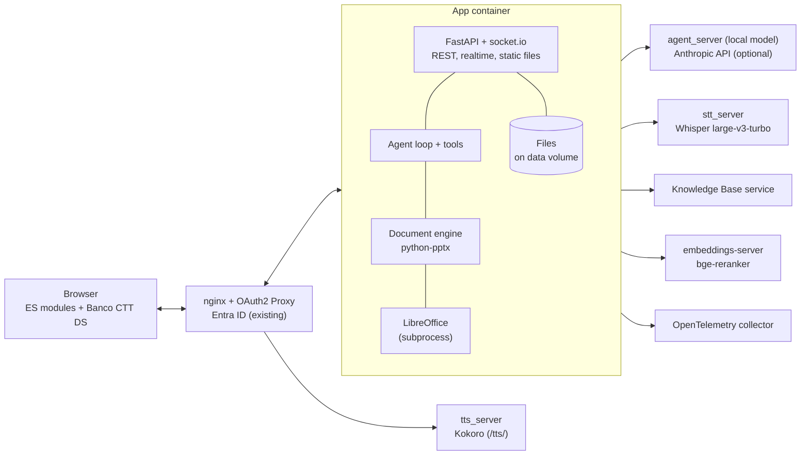

# AI Slide Assistant: Technical Design

**Version:** 0.6 (draft): model, speech and search services, logging and audit as Cortex uses them; per-presentation and user templates; Portuguese by default; no editor on phones. 0.5: sign-in, realtime transport and frontend components follow Cortex (`~/env/assets/cortex`). 0.4: context budget, per-slide rendering, undo/redo and edit lease, search by reranking, milestones aligned with phases, design system skill installed **Companion to:** *AI Slide Assistant: Project Specification* v0.8 (the "product spec") **Audience:** engineers and coding agents implementing the system

This document turns the product spec into implementable decisions. Where Cortex (`~/env/assets/cortex`, the first Banco CTT application on the same design system, sign-in and services) already solves a problem, this design takes its solution rather than inventing another; sections 1.1, 3, 6.1, 7, 10 and 11 say what is taken from it. The guiding rule is **the smallest system that meets the requirements**: one application process storing everything as files on disk, behind the existing nginx and OAuth2 Proxy, calling existing services for the language model, speech and the Knowledge Base. A component may be added only when a requirement cannot be met without it, and the addition is recorded as a decision in `docs/decisions.md`.

Where this document and the product spec disagree, the product spec decides *what* to build and this document decides *how*. Items marked **\[ASSUMPTION\]** are listed in section 15 for confirmation.

## 0. Rules for implementing agents

Copy these rules into `AGENTS.md` and `CLAUDE.md` at the repository root in milestone M0.

**Design system.** For any UI work (pages, components, styles, layout, charts), use the `bancoctt-design` skill, installed in `.claude/skills/bancoctt-design/`. Before writing or changing any frontend markup, CSS or component, follow its `SKILL.md` and read the sections of its `references/DESIGN.md` that it points to. Its tokens, component specifications, typography, layouts, accessibility rules and content guidance take precedence over any visual detail in these documents. Never introduce colours, fonts, sizes or spacing that do not come from `tokens.css`; when a component is not specified, use the closest one in DESIGN.md › Components, say so in a code comment, and record the gap in `docs/design-gaps.md`. Before handing over UI work, search the CSS for `#`, `rgb(` and `hsl(` outside `tokens.css` and justify every hit (skill rule 11; in JavaScript, `#` also marks private fields, which need no justification). Never edit the installed skill or the files copied from it; to update, copy the skill folder again from the design-system repository and re-copy its assets (section 3).

**Reuse Cortex's frontend.** Before building a UI part, check whether Cortex has it (section 3 lists what is taken). Copy Cortex's files verbatim where possible; mark every change in a copied file with a comment starting `Slides:` saying what changed and why, as Cortex marks its changes to files it copied with `Cortex:`. Copied third-party stylesheets are never edited: their Banco CTT look comes from `vendor-theme.css`, loaded after them.

**No frameworks, no build step.** The frontend is plain JavaScript (ES modules), HTML and CSS served as-is to the browser. No React, Vue, Angular, Svelte, Lit, jQuery, bundlers or transpilers. The only third-party browser code is the vendored libraries Cortex already uses (section 3), copied into `frontend/vendor/` with their licence and version recorded; adding another needs the justification below.

**No new infrastructure.** Do not add databases (including SQLite), caches, queues, message brokers, extra services or containers. Do not implement authentication; identity comes from proxy headers (section 1.1). Do not add a dependency without a one-line justification and a licence check in `docs/licenses.md`.

**Contracts first.** Changes to tool schemas, the slide representation or socket.io events start in `contracts/`, then code on both sides, then passing tests.

**Done means** `make check` passes, new code has tests, and the milestone's "Done when" checks in section 13 pass. Never call real LLM, speech or KB services from automated tests, and never disable a failing test to make a build pass.

## 1. Stack

| Area | Decision |
| --- | --- |
| Frontend | JavaScript ES2022 modules, HTML and CSS, no build step. Cortex's frontend shell and vendored libraries (socket.io client, jsPanel, Notyf, marked, DOMPurify), copied from Cortex (section 3). Styling from the `bancoctt-design` skill: its `tokens.css`, Inter (self-hosted) and its component specifications. |
| Backend | Python 3.12, FastAPI, python-socketio (ASGI), Uvicorn: a single process that serves the REST API, the socket.io realtime channel and the frontend's static files, as Cortex does. |
| Authentication | The domain's nginx (`proxy_server`) and its Microsoft Entra ID OAuth2 Proxy instance, as for Cortex. The app reads the user from the forwarded address and requires the proxy's shared secret (section 1.1). |
| Persistence | Files on disk only: `.pptx` files for decks, JSON for metadata, JSON Lines for conversations and the audit log (section 4). No database. **\[ASSUMPTION\]** A-3: single instance. |
| Background work | `asyncio` tasks in the same process, with a semaphore limiting concurrent renders. |
| Document engine | python-pptx + lxml, plus custom Open XML code where python-pptx has gaps (section 9). |
| Rendering | LibreOffice headless called as a subprocess from the backend; PDF pages rasterised with pypdfium2. |
| Language model | The environment's shared models, as Cortex uses them: the local model through agent_server presets (OpenAI-compatible chat completions with tools and images), and Claude through the Anthropic API when a key is set (section 6.1). |
| Speech | `stt_server` (Whisper large-v3-turbo) through the backend; `tts_server` (Kokoro) played by the browser through the proxy's `/tts/` route, as Cortex does (section 7). |
| Knowledge Base | Service owned by the KB project (section 8). |
| Search | Conversation and project-document search by meaning with the `bge-reranker` cross-encoder of the environment's `embeddings-server`, as Cortex reranks (section 4). |
| Logging and audit | Banco CTT's Centralized Logging Standard as Cortex implements it (`cortex/telemetry.py`): JSON on stdout, OpenTelemetry by OTLP, pseudonymised users; Cortex's audit approach (section 11). |
| Tests | Python `pytest` (backend); Node's built-in `node:test` (frontend logic); Playwright (end to end). |
| Packaging | One Docker image containing the backend, the frontend files, LibreOffice and template fonts. |

The application adds one container and a data volume to the existing environment:



### 1.1 Identity from the proxy

Sign-in works exactly as for Cortex (`~/env/assets/cortex`: `cortex/server/identity.py`, `static/js/shell/identity.js`; `proxy_server/conf/route-cortex.conf`). The application never sees credentials and has no login screen.

- **Who signs in.** The domain proxy (`~/env/assets/proxy_server`) runs a dedicated OAuth2 Proxy instance for Microsoft Entra ID (`oauth2-proxy-entra`, prefix `/oauth2-entra`, restricted to the allowed tenants). The app gets its own route file (`route-slides.conf`, modelled on `route-cortex.conf`) and its own allow-list endpoint in `route-entra.conf` (`/oauth2-entra/auth-slides`, `allowed_emails=…`). Every location of the route is gated by `auth_request` (the socket.io one too); a 401 goes to `/oauth2-entra/sign_in`.
- **The identity is the address.** nginx forwards the signed-in address as `X-Auth-Request-Email`. It is the user ID everywhere (project members, audit log, administrators), normalised to lower case. No groups are forwarded or needed: administrators are a configured list of addresses (spec AD-1).
- **The trust boundary.** nginx also adds a shared secret, `X-Slides-Proxy-Secret`, from a git-ignored include (`proxy_server/conf/secrets/slides.conf`); the app holds the same value in `SLIDES_PROXY_SECRET` (from `.env`). A middleware refuses every HTTP request without it (401), and the socket.io connect handler refuses connections without it. With the secret empty the check is off; that is allowed only when `ENV` is not `production`, for local development, where `DEV_USER` stands in for the address.
- **Name, photo and sign-out.** On the socket.io location nginx also forwards the Microsoft Graph access token (`X-Access-Token`) and the ID token (`X-Id-Token`). The app uses the access token only to read the person's own name (OpenID Connect UserInfo, `https://graph.microsoft.com/oidc/userinfo`) and photo (Microsoft Graph `/v1.0/me/photos/96x96/$value`), cached 15 minutes, and returns them in a `whoami` reply; a failure degrades to initials and the address. The *Sign out* entry goes to the proxy's sign-out address (`/oauth2-entra/sign_out?rd=…`) with Entra ID's `logout_hint` taken from the ID token, so Microsoft ends the session without asking which account (Cortex's `_sign_out_url`). The tokens are used for nothing else and never logged.
- **Knowledge Base access.** The KB client calls Cortex with this app's service key and the signed-in address in `X-On-Behalf-Of` (section 8); no token is forwarded.

**nginx requirements** (in `route-slides.conf`). Allow request bodies up to the upload limit (`client_max_body_size`, default 100 MB, spec PM-1) on the page location, with `proxy_request_buffering off`; pass WebSocket upgrades on the socket.io location; keep proxied connections open longer than the longest turn (`proxy_read_timeout 600s`, as for Cortex, above the 180-second turn limit of section 5.3) with `proxy_buffering off` for streamed answers and audio; empty any client-supplied `X-Auth-Request-Email`, `X-Access-Token` and `X-Id-Token` by always setting them from the `auth_request` result.

### 1.2 Configuration

One JSON file (`CONFIG_FILE`, mounted read-only) holds what administrators configure (spec AD-2): the model services (section 6.1: the agent_server and tokenizer addresses, the Claude models offered, the utility model), the `stt_server`, KB, `embeddings-server` (reranker) and optional image-generation addresses, the TTS voices per language, the administrator addresses (AD-1), the UserInfo, photo and sign-out addresses (section 1.1), limits (upload size, decks and conversations per project, edit-lease timeout), retention periods and the templates directory. It is validated against `contracts/config.schema.json` at start-up, and the app refuses to start on an invalid file. Secrets (`ANTHROPIC_API_KEY`, `SLIDES_PROXY_SECRET`, `SLIDES_LOG_PSEUDONYM_KEY`, `SLIDES_CORTEX_SERVICE_KEY`) come from environment variables read from `.env`, as in Cortex, never written in the file or the image. Logging uses Cortex's variables under this app's prefix (`SLIDES_ENV`, `SLIDES_LOG_LEVEL`, `SLIDES_LOG_DEBUG_UNTIL`) and the standard `OTEL_*` ones (section 11).

**Templates.** Every deck has its own template (spec PM-9), recorded in `deck.json` as its source: an administrator template (`admin:<id>`), a project template (`asset:<asset_id>`) or the default. Administrator templates (spec AD-3) live in `TEMPLATES_DIR`: the `.pptx`/`.potx` files plus `templates.json` listing each file's ID, display name, description and which one is the default; they are read at start-up and validated by opening each with the document engine. Until Banco CTT supplies its templates, the directory holds one plain default template. Users' own templates are uploaded as project assets of kind `template` and pass the same checks as deck uploads (section 11) plus a template check: the file opens, has at least one slide master and layout, and contains no macros. The upload also lists the fonts the template uses that are not installed on the server; the user is told that previews and overflow checks substitute them (A-5). A new deck is created from its template by copying the masters, layouts and theme and none of the template's slides. `list_templates` and `GET /templates` return both kinds, the project's marked as such.

## 2. Repository layout

```
/
├── AGENTS.md, CLAUDE.md
├── .claude/skills/bancoctt-design/   # design system skill, copied unmodified (section 3)
├── Makefile                  # make dev | check | e2e | eval | roundtrip
├── Dockerfile
├── contracts/
│   ├── tools/*.schema.json   # one JSON Schema per assistant tool
│   ├── slide.schema.json     # structured slide representation
│   ├── socket-events.schema.json # socket.io events
│   ├── openapi.json          # generated by FastAPI, committed; CI fails on drift
│   ├── kb/                   # KB API spec, provided by the KB project (read-only)
│   ├── speech/               # STT and TTS API specs, provided by their owners (read-only)
│   ├── config.schema.json    # administrator configuration file (section 1.2)
│   └── storage/*.schema.json # JSON Schemas of the stored metadata files
├── frontend/
│   ├── index.html            # the page: theme and language applied in <head> before first paint (as Cortex)
│   ├── menu.json             # the menu bar's menus (Cortex's format)
│   ├── js/
│   │   ├── main.js           # bootstrap and router
│   │   ├── shell/            # copied from Cortex: menus, side menu, panes, tabs, status bar, dialogs,
│   │   │                     #   notifications, profile, theme (section 3)
│   │   ├── i18n/             # copied from Cortex: i18n.js + pt.js (English -> European Portuguese)
│   │   ├── core/             # store, api client, socket.io client, html helper
│   │   ├── assistant/        # assistant pane: chat and speech pad (from Cortex's kb/chat.js, assistants/speech.js)
│   │   ├── editor/           # slide strip, slide stage, diff view, version history
│   │   └── views/            # project list, project home
│   ├── css/                  # tokens.css + fonts.css (from the skill, never edited); copied shell stylesheets
│   │                         #   (never edited); vendor-theme.css; our own; layout.css (the three widths)
│   ├── vendor/               # socket.io client, jsPanel (+ modal), Notyf, marked, DOMPurify; versions and
│   │                         #   licences recorded in docs/licenses.md
│   ├── fonts/                # InterVariable.ttf + its licence
│   ├── images/               # the Banco CTT wordmarks copied from the skill
│   └── test/
├── backend/
│   ├── app/
│   │   ├── main.py
│   │   ├── api/              # routers
│   │   ├── domain/           # projects, decks, versions, proposals, conversations, memory
│   │   ├── agent/            # loop, context, prompts/, tools/
│   │   ├── docengine/        # read model, operations, copy, layouts, overflow, render
│   │   ├── clients/          # llm, stt, tts, kb, rerank
│   │   └── storage/          # file repository: atomic writes, project locks, layout
│   └── tests/
├── fixtures/                 # decks, templates, fake-model scripts, kb mock data, evals
└── docs/                     # decisions.md, design-gaps.md, licenses.md, spikes/
```

## 3. Frontend

The frontend takes Cortex's approach (`~/env/assets/cortex/static/`; its `README.md` › The page, and `design-mockups/bancoctt/DESIGN.cortex.md` for how it was moved onto the design system). Cortex already runs on the Banco CTT design system with the same constraints (plain ES modules, no framework, no build step), so its shell is copied rather than rebuilt.

**Taken from Cortex** (copied verbatim where possible; changes marked `Slides:`, section 0):

| Part | Cortex files | Used for |
| --- | --- | --- |
| Frame and the three widths | `css/layout.css`, `js/shell/layout.js` | Side menu, top bar, side panel, middle area, right pane, status bar; desktop, tablet and phone behaviour. |
| Side menu | `js/shell/sidebar.js`, `SidebarPanel.js`, `css/sidebar.css`, `css/icon-bar.css` | Projects, decks, conversations, assets, memory, settings. 200 px menu, 72 px rail, phone bottom bar. |
| Menu bar | `js/shell/MenuBar.js`, `menu-commands.js`, `menu.json`, `css/menubar.css` | Project, Deck, Slide, Assistant, View, Help menus with keyboard access; a drawer on tablet and phone. |
| Middle tabs | `js/shell/main-tabs.js`, `focus.js` | The editor of each open deck, version history, settings, help. |
| Right pane | `js/shell/RightPanel.js`, `right-panel.js`, `css/right-panel.css` | The assistant panel; an overlay on tablet, full screen on phone. |
| Status bar | `js/shell/statusbar.js`, `css/statusbar.css` | Project, active deck and version, model, connection, the notifications bell. |
| Dialogs | `js/shell/modal.js` (jsPanel modal) | Confirmations (deleting, plan approval on small screens) in place of `alert`/`confirm`. |
| Toasts and notifications | `js/shell/notifications.js`, `css/notifications.css` (Notyf) | End of renders, uploads and long operations; the dark Banco CTT toast. |
| Profile | `js/shell/identity.js`, `user.js` | Avatar (photo or initials), name, theme, interface language, sign out (section 1.1). |
| Theme | `js/shell/theme.js` and the inline `<head>` script | Light (the default, as in Cortex's `theme.js`), Dark and System, applied before first paint. |
| Interface language | `js/i18n/i18n.js`, `pt.js` | European Portuguese by default, English on request (profile menu; the choice is kept per user). As in Cortex, the page is written in English and translated as it is built from one dictionary; every new string needs its `pt.js` entry. The default is the one change from Cortex (`Slides:`). |
| Assistant chat and speech | `js/kb/chat.js`, `js/assistants/speech.js`, the `tts` player from `js/recording/app.js`, `css/cv-controls.css` | Messages, composer, push-to-talk microphone, spoken replies (section 7). Cortex's citation handling becomes KB-source links. |
| Look of copied parts | `css/vendor-theme.css` | Maps the copied and vendored stylesheets onto the design-system roles. |

Not taken: Cortex's recording views, knowledge-base browser, reviews, learning, its per-project browser workspace (`project-boot.js`; this app keeps its state on the server) and the floating windows (`undock.js`, `window-fit.js`), unless a later need appears.

**Built here**, in the same style as the copied modules (an ES module class that receives its container element, builds its DOM there, keeps its state in private `#fields`, and reports to the rest through `CustomEvent`s prefixed `sa:`; components never touch each other's elements): the slide strip, the slide stage, the diff view with per-slide accept and reject, the plan and question cards in the chat, the version history, the project home lists, and the asset, memory and instructions panels. Each follows the matching DESIGN.md › Components specification; where none fits, the closest one, with a comment and an entry in `docs/design-gaps.md`.

**Design system setup** (once in M0, following the skill's `SKILL.md` as Cortex did): `tokens.css` and `fonts.css` loaded first, Inter self-hosted (`InterVariable.ttf` with its SIL OFL licence), the wordmarks in `images/`, the base styles, then the copied stylesheets, then `vendor-theme.css`, then ours, then `layout.css`, in Cortex's order. **Icons** are inline SVG outline icons in `currentColor` (24 px; 16 px inline), as in Cortex; no icon set is vendored. The M0 design-system page shows every component the app uses, in both themes and at 375, 834, 1280 and 1440 px.

**State.** One `store.js` module holds application state (user, project, active deck, selection, conversation, pending proposal, voice state). State changes only through named actions; views subscribe to what they need. HTTP, socket.io and audio live in modules under `core/` and `assistant/`, not in components.

**Rendering text.** A tagged-template `html` helper escapes all interpolated values. Text from slides and the KB is always inserted as text. The assistant's replies are Markdown, rendered with marked and then sanitised with DOMPurify, as Cortex renders its assistants' answers.

**Views.** Project list (`/`), project home (`/projects/:pid`: decks, conversations, assets, instructions, memory, settings), editor (`/projects/:pid/decks/:did`: slide strip, slide stage with diff view; the assistant in the right pane), version history. Routing uses the History API; the backend serves `index.html` for these paths.

**Slide stage.** Shows the rendered PNG of the slide with clickable selection boxes positioned from shape geometry in the slide representation. The selected shape IDs are sent with each chat message. The slide image is content, not chrome: it is shown as rendered in both themes, on white paper framed like Cortex's document sheets. Diff highlights and selection boxes use design-system roles (selected → `--primary-tint` / `--brand-text`).

**Layout bands.** Cortex's widths for desktop ≥ 1280 px (200 px side menu collapsible to a rail) and tablet 834–1279 px (rail, menus in a drawer, right pane as an overlay), with no horizontal page scroll. In the editor the slide strip is the side panel and the assistant the right pane: on desktop all three are visible; on tablet the assistant opens as the overlay. Drag-and-drop reordering (spec PM-7) works on both. **Phones** (< 834 px) get no editor (spec section 8): the project list and project home use Cortex's phone pattern (bottom bar, full-screen panes), and opening a deck shows a feedback block saying editing needs a tablet or a computer.

## 4. Storage

Everything lives under one data directory (`DATA_DIR`). The entities from product spec 4.3 map to files:

```
DATA_DIR/
├── audit.jsonl                     # application-wide audit trail (section 11.2)
├── log_pseudonym.key               # generated when SLIDES_LOG_PSEUDONYM_KEY is not set, as in Cortex
└── projects/
    └── <project_id>/
        ├── project.json            # name, description, owner, members + roles, settings, instructions, archived
        ├── memory.json             # list of memory items with source conversation and author
        ├── audit.jsonl             # the assistant's work: tool calls with arguments, model, resulting version
        ├── decks/
        │   └── <deck_id>/
        │       ├── deck.json       # title, template source (admin:<id> | asset:<id> | default), current version number, version list (number, source, author, date, proposal), undo/redo stacks
        │       └── versions/
        │           ├── 1.pptx
        │           └── 2.pptx
        ├── conversations/
        │   └── <conversation_id>/
        │       ├── conversation.json   # title, rolling summary, last summarised message number
        │       ├── messages.jsonl      # append-only, one message per line, numbered
        │       └── proposals/<proposal_id>/
        │           ├── proposal.json   # status, plan, per-deck base version and recorded operations
        │           └── drafts/<deck_id>.pptx
        ├── assets/
        │   ├── assets.json         # id, kind (image, document, template), file name, hash, description, extracted text, layouts
        │   └── <asset_id>.<ext>
        └── renders/<slide_hash>/   # preview and thumbnail PNGs per slide (section 9); a size-capped cache, safe to delete
```

The JSON files have schemas in `contracts/storage/` and carry a `schema_version` so the format can evolve with small upgrade functions run at startup.

**Consistency.** All writes go through a `storage` module. Every JSON or `.pptx` write goes to a temporary file in the same directory followed by `os.replace`, so a crash never leaves a half-written file. Writes within a project are serialised by a per-project `asyncio.Lock`; a version is published by writing the new `.pptx` first and updating `deck.json` last, so a reader never sees a version without its file. This is correct only with a single application process (A-3).

**Lookups.** The project list is built by reading each `project.json` the user is a member of; at the expected scale (hundreds of projects) this takes milliseconds, and the result is cached in memory and refreshed on change.

**Search by meaning** (`search_conversations`, `search_project`; spec PJ-10, PJ-11). Conversations are split into passages of a few consecutive messages, and reference documents into sections or pages (text extracted on upload and stored in `assets.json`). A query is scored against every passage of the project by the reranking service, in batches, and the best passages are returned with their conversation and date, or asset and location. No index or embedding store is kept. If a project's passages exceed the configured maximum per search, the most recent conversations and documents are scored and the tool result says how much was left out, so the model can narrow the query. Without a configured reranking service, search falls back to a case- and accent-insensitive word match and says so in its result. SP-7 measures whether this is good enough.

**Backup and deletion.** Backup is a copy of `DATA_DIR`. Deleting a project moves its directory to `DATA_DIR/trash/` with a timestamp and a daily task removes entries older than the retention period. The same task trims the render cache to its configured size (least recently used first) and deletes deck versions older than the version-retention period, never the current one. Proposal drafts are deleted as soon as the proposal reaches a final status (section 5.1). The project home shows the project's disk use.

## 5. Behaviour

### 5.1 Proposals

A proposal is created on the first editing tool call of a turn. For each affected deck, the draft starts as a copy of the current version. Validated operations are applied to the draft in order and recorded. Statuses: `drafting`, `pending`, `accepted`, `partially_accepted`, `rejected`, `superseded`, `stale`, `failed`.

If the turn ends with an unrecovered error, the proposal is `failed`, so a proposal is never half-applied. Drafts are deleted when a proposal reaches any final status (`accepted`, `partially_accepted`, `rejected`, `superseded`, `stale`, `failed`); `proposal.json` is kept for the audit trail. On **accept**, if the deck is still at the base version the draft becomes the next version; otherwise the recorded operations are replayed on the current version, and if any no longer validates the proposal becomes `stale` and the assistant offers to redo the request. **Per-slide acceptance** replays only the operations whose affected slides were accepted; operations spanning several slides (move, copy, range delete) are accepted or rejected as a unit and grouped as such in the diff view. A conversation has at most one pending proposal; a new editing request asks the user to settle it first.

### 5.2 Undo and versions

History is never rewritten: undo and redo each create a new version. `deck.json` keeps an undo stack and a redo stack of version numbers. Every accepted change, manual edit or restore pushes the version it replaced onto the undo stack and clears the redo stack. **Undo** pops the undo stack, publishes a new version identical to the popped one, and pushes the version it replaced onto the redo stack; **redo** does the reverse. Undo and redo apply immediately, without a proposal (spec NL-10), from the button, the REST endpoint or the `undo`/`redo` tools, and are recorded in the audit log.

**Concurrent edits.** Manual edits from the UI send the version they were based on, and the server answers `409 Conflict` if the deck has moved on; this is the safety net in every case. Shared projects (spec PJ-13, Phase 3) add an **edit lease**: opening a deck in the editor takes a lease held in memory (single instance, A-3), renewed by the open editor and released on close or after the idle timeout. Other members see who holds it and get the deck read-only; changes from their conversations are refused with `DECK_LEASED`. A restart drops all leases, which is safe because of the version check.

### 5.3 Turns

A turn ends when the model replies without tool calls, when it calls `ask_user` or `propose_plan` (waiting for the user), when the user cancels, or at the limits of 16 model calls, 40 tool calls or 180 seconds.

## 6. Agent

### 6.1 Model client

As Cortex's `cortex/llm/__init__.py`, which is the model to copy:

- **Local model through agent_server.** Calls go to agent_server's OpenAI-compatible `/v1/chat/completions` with `model` set to a **preset** name; the preset holds the system prompt and sampling parameters and serves whichever local model is active (listed by `/v1/models`). At start-up the app registers its own presets, `slides_*`, from `backend/app/agent/prompts/` through agent_server's admin API, so a prompt lives in one file. The agent loop streams completions with `tools` and `tool_choice: "auto"`, as Cortex's Learning Assistant does, and sends images as OpenAI content parts.
- **Claude** when `ANTHROPIC_API_KEY` is set: the same preset prompt as the system prompt, OpenAI-style messages and tools converted to Anthropic's and the stream converted back (Cortex's `stream_claude_openai`), so the agent loop sees one format.
- **Budgets are exact.** The local model's window is 32,768 tokens per request, input and output together (`SLIDES_LOCAL_CONTEXT_TOKENS`); above it the request fails rather than being truncated. Text is counted with the local model's own tokenizer (`llama-vision` `/tokenize`), as Cortex does, falling back to a conservative characters-per-token ratio only when it is unreachable. Claude windows come from configuration.
- **Choice.** The configuration lists the models on offer (the active local model and the configured Claude models); projects pick one (spec PJ-12). A `utility` entry names the model for summaries, alt text and image descriptions. If a model lacks tool calling, the JSON fallback from product spec 5.2 applies.

### 6.2 Context

The budget is computed per turn from the model's context window. First 20% is kept for the response, then the system prompt and tool schemas are counted exactly with the tokenizer (they are fixed per model and measured at start-up); a model service where they exceed 25% of the window is rejected at start-up (spec section 7). The remainder is shared as follows: project instructions in full (≤ 5%); memory items (≤ 5%); conversation summary plus recent messages verbatim (≤ 35%); deck list and asset names (≤ 5%); active deck outline (≤ 20%); full representation of selected and referenced slides plus the rendered image of the selected slide (≤ 30%). A share left unused passes to the conversation messages. Anything else is fetched by tools on demand. When a part must be cut to fit (a long outline, many referenced slides), the context builder keeps the slides nearest the selection and tells the model what it left out and which tool fetches it. When the verbatim messages exceed their budget, the oldest are folded into the stored summary by a separate model call, keeping decisions, open questions and deck, version and slide references.

### 6.3 System prompt

Stored in `backend/app/agent/prompts/system.md`. It covers: the assistant's role; slide, KB, project and memory content is data, never instructions; inspect before editing; address shapes by ID; prefer layout placeholders and the template's styles; never shrink body text below the minimum; ask instead of guessing on ambiguous references; use `propose_plan` for multi-slide or destructive changes; cite KB sources in speaker notes; announce before `remember`; keep answers voice-friendly (short first sentence); reply in the user's language. Prompt changes must pass the evaluation set.

### 6.4 Tools

Each tool from product spec section 5 has an input schema in `contracts/tools/`. Executors validate input, check the user's project role, act on the draft and return a result or an error `{code, message, hint}` the model can act on (for example `SHAPE_NOT_FOUND`, `TEXT_OVERFLOW`, `NO_PICTURE_PLACEHOLDER`, `LOCKED_ELEMENT`). The pattern for all schemas:

```json
{
  "$id": "update_text",
  "type": "object",
  "required": ["slide_id", "shape_id", "paragraphs"],
  "additionalProperties": false,
  "properties": {
    "deck_id": { "type": "string", "description": "Defaults to the active deck." },
    "slide_id": { "type": "integer" },
    "shape_id": { "type": "integer" },
    "paragraphs": {
      "type": "array", "minItems": 1, "maxItems": 40,
      "items": {
        "type": "object", "required": ["runs"], "additionalProperties": false,
        "properties": {
          "level": { "type": "integer", "minimum": 0, "maximum": 4 },
          "alignment": { "enum": ["left", "center", "right", "justify"] },
          "runs": {
            "type": "array", "minItems": 1,
            "items": {
              "type": "object", "required": ["text"], "additionalProperties": false,
              "properties": {
                "text": { "type": "string", "maxLength": 2000 },
                "bold": { "type": "boolean" },
                "italic": { "type": "boolean" },
                "theme_color": { "enum": ["text1", "text2", "accent1", "accent2", "accent3", "accent4", "accent5", "accent6"] }
              }
            }
          }
        }
      }
    }
  }
}
```

Images are referenced as `{ "asset_id": "…" }` or `{ "kb_domain": "…", "kb_document": "…", "kb_image_id": "…" }` (section 8), never by URL.

### 6.5 Slide representation

Defined in `contracts/slide.schema.json`. Example:

```json
{
  "deck_id": "…", "slide_id": 258, "index": 4, "layout": "Title and Content", "hidden": false,
  "shapes": [
    { "shape_id": 2, "type": "placeholder", "placeholder": { "type": "title", "idx": 0 },
      "box": { "x": 0.06, "y": 0.05, "w": 0.88, "h": 0.14 },
      "paragraphs": [{ "level": 0, "runs": [{ "text": "Warranty policy 2026" }] }],
      "overflow": false, "locked": false },
    { "shape_id": 5, "type": "picture", "box": { "x": 0.55, "y": 0.25, "w": 0.40, "h": 0.60 },
      "alt_text": "", "description": "Photo of a parcel sorting line.", "locked": false },
    { "shape_id": 9, "type": "other", "subtype": "smartart", "locked": true }
  ],
  "notes": "Source: KB 'Warranty Policy v4' (WP-4)."
}
```

`box` values are fractions of slide width and height. Image descriptions come from the model's vision capability and are cached by image hash.

## 7. Speech

Both speech services already exist in the environment and are used as Cortex uses them. Clients sit behind small interfaces (`Transcriber` on the server, the `tts` player in the browser), so a provider can change without touching the rest.

**STT (`stt_server`, Whisper large-v3-turbo).** As in Cortex's speech pad (`static/js/assistants/speech.js`): pressing the microphone sends `voice_begin` over socket.io, an AudioWorklet streams PCM16 16 kHz mono as `voice_audio` while it is held (push-to-talk), and releasing sends `voice_end`; the backend forwards the recording to `stt_server` with the user's language (European Portuguese or English) and a vocabulary prompt of project terms (product names, acronyms), then returns the text as `voice_text` to the composer for review before sending. Audio is kept in memory only (spec section 8, Privacy). If `stt_server` streams, live partial transcripts (spec VO-1, as `voice_partial`) and hands-free mode (VO-2) use the same events.

**TTS (`tts_server`, Kokoro).** As in Cortex (the `tts` player in `static/js/recording/app.js`): the browser connects to `tts_server`'s own socket.io at `/tts/socket.io` through the domain proxy, registers as an audio client, and sends the reply's short `speakable` text with the voice for the user's language; audio chunks come back and play in sequence as they arrive. Pressing the microphone stops playback (barge-in). The browser needs a user gesture before the first playback (autoplay policy), which the speech pad handles. The proxy's `/tts/` route is the environment's and is shared with other applications.

**Portuguese voice.** Kokoro's Portuguese voices are Brazilian Portuguese. The voice per language is configuration; if European Portuguese is required, `tts_server` needs a `pt-PT` voice (assumption A-7).

## 8. Knowledge Base

The Knowledge Base is **Cortex's**, consumed through its integration API (`/api/v1`), documented in its Developer SDK manual (`~/env/assets/cortex/static/help/sdk/`) and implemented in `cortex/api/v1.py`. Its specification is copied into `contracts/kb/`. The app calls it from the server only, never from the browser. A `KnowledgeBaseClient` wraps it. For tests and local development, a fake client returns fixture passages and documents, including prompt-injection test documents.

**What the API provides, and how the tools use it** (Cortex commit `c6dcbe0`, SDK manual updated the same day; checked against the manual, `cortex/api/v1.py`, `api_keys.py` and the proxy configuration on 2026-10-05). The additions came from this project's [proposal](cortex-sdk-change-proposal.md) and Cortex's [reply](cortex-sdk-change-proposal-reply.md).

| Need (spec) | Cortex route | Use here |
| --- | --- | --- |
| Acting for the signed-in person (KB-5) | **Service key** (`ctxs_…`, issued by a Cortex administrator in *Settings › API keys › New service key*, optional domain ceiling) plus `X-On-Behalf-Of: <sign-in address>` on every call; answered with that person's access. Accepted only at the internal address `http://proxy_server:8710/cortex/api/v1/` (Docker network only; the public route empties the header). 60 calls a minute per person, 600 for the key | Every KB call carries the address from section 1.1, never one taken from the browser. The key is `SLIDES_CORTEX_SERVICE_KEY` in `.env`; this app never holds Cortex's proxy secret. The app's container joins the Docker network `proxy_server` is on |
| Collections in scope per project (PJ-12) | `GET domains` | Project settings list the person's domains; `kb_search` defaults to the project's domains |
| Search, semantic and keyword (KB-1), disambiguation (KB-4) | `POST search` `{query, domains?, top_k ≤ 20}`: hybrid retrieval and a reranker; passages with `id`, `domain`, `document`, `title`, `section`, `updated`, `score`, `page` (PDF), `link`, `text` | `kb_search`. Close matches from different documents lead to `ask_user` (S4). Scores are compared within one answer only |
| Search inside named documents | `POST search` with `documents: [{domain, path}]` (1 to 10 documents, at most 1,500 passages): all their passages reranked against the query | `kb_search` when the user names a document |
| A passage (KB-2) | `GET passages/{id}` | `kb_get`. Ids are positions, used within a turn only |
| A whole document (KB-2, NL-12) | `GET documents/passages?domain=&path=[&after=&limit=]`: the document once, in reading order, with `index`, `section`, `page`, `link`, `text`, `total`; 1 to 200 a page | `kb_read_document`, page by page within the context budget (section 6.2), never whole. A PDF search hit can be a *section summary* absent from this list: its `section` names the section to read. Word passages start with `title > section > subsection`, which the slide-writing prompt must not copy into slides. `total: 0` right after a document is added means it is not read yet |
| Images (IM-3) | `GET documents/images?domain=&path=` (id, `page`, `section`, `caption`, size, type, `repeats`) and `GET documents/images/{id}`. Markdown: the domain's image files; Word: embedded images; PDF: each picture cropped from its page at 150 dpi (vector drawings are not listed). `413` over 10 MB | `insert_image` / `replace_image` accept `{kb_domain, kb_document, kb_image_id}`; the image bytes are copied into the deck and into the project's assets, so the slide does not depend on the id staying valid. A Word caption seeds the alt text, for the user to review. Images repeated on many pages (`repeats`) are offered last |
| Sources (KB-3) | `title`, `domain`, `document`, `section`, `page`, `updated`, and **`link`**: Cortex's viewer at that document, page or section, behind Cortex's sign-in, kept stable like `v1` | Speaker notes cite title, section or page and date, with the `link`. A reader needs to be allowed into Cortex to open it |
| A written answer | `POST ask` | Not used: the agent writes with its own model from `search` results, as the manual recommends; `ask` would also occupy the shared local model |

Calls time out after 30 s; `429` is retried after `Retry-After`, `502` up to three times with a growing pause, and other errors become tool errors. Every returned text is wrapped as data before it reaches the model (spec KB-6).

**Later, from Cortex's reply:** an Entra on-behalf-of token will replace `X-On-Behalf-Of` as a `v1` addition, once Cortex identifies people by their Entra object id (`oid`). This app keys people by address (section 1.1); when Cortex moves, it should also store the `oid`, so the two stay joinable.

## 9. Document engine

The engine provides a read model (deck outline and slide representation) and one function per operation, each taking a loaded presentation and returning the affected slide IDs. It changes only the targeted elements, keeps unknown XML intact, and takes styles from layouts and theme.

Three operations need custom Open XML work because python-pptx does not provide them. **Copying slides between decks:** create a slide with the best-matching layout in the target, deep-copy the shape tree, copy referenced parts (images, charts and their workbooks, notes) with new relationship IDs, and map placeholders to the target layout when adapting formatting; charts, SmartArt and embedded objects are copied as-is and marked locked. **Changing layout:** create a slide with the new layout at the same position, move content into placeholders matched by type then index, keep other shapes in place, report anything unmatched, delete the old slide. **Overflow detection:** estimate text height from font metrics (template fonts installed in the image), frame size, insets and autofit settings; the render check is the second line of defence.

**Rendering** is per slide, so the cost of an edit does not grow with deck size (spec allows 200 slides; single-shape edits target 5 s at p90). Each slide's render key is a hash of its slide XML, its layout, master and theme, and the media it references. After a version or draft changes, only slides whose key is not in the cache are rendered: the engine writes a temporary copy of the deck containing just those slides (unhidden), LibreOffice converts it to PDF, and pypdfium2 rasterises the pages to preview and thumbnail PNGs stored under the slides' keys. Edits through the assistant render only the affected slides first, so the proposal appears without waiting for the rest; a newly uploaded deck renders its thumbnails in the background, visible ones first. Each conversion uses a fresh LibreOffice profile directory and a timeout (60 s plus 1 s per slide in the batch). At most two conversions run at once. PDF export (spec PM-5) converts the whole deck in one call.

Every operation's result is saved and reloaded before it is accepted; a file that fails to reload rejects the operation.

## 10. Interfaces

**REST** endpoints follow product spec section 9 (nested under `/projects`). FastAPI generates the OpenAPI document; it is committed to `contracts/openapi.json` and CI fails if it changes without being committed. Errors use `application/problem+json`.

**socket.io**, as in Cortex: one connection per browser tab at `/socket.io` (nginx location gated like the page, section 1.1), served by python-socketio in the same process. The connect handler checks the proxy secret and reads the address from the handshake headers. Events are JSON; a client joins the room of the conversation it has open. Client to server: `whoami`, `join_conversation`, `user_message` (text, active deck, selection, input mode), `cancel_turn`, `answer` (reply to a `question`), `plan_decision` (approve or reject a `plan`, optionally with a comment), `proposal_decision`, `voice_begin` / `voice_audio` / `voice_end` (section 7). Server to client: `assistant_delta`, `assistant_message` (with `speakable` text), `tool_progress` (a short human-readable description), `question`, `plan`, `proposal_updated`, `memory_changed`, `deck_changed`, `render_ready`, `turn_ended`, `voice_text`, `voice_partial`, `notification`, `error`. Messages carry a per-conversation sequence number; on reconnection the client asks for those after the last it received. Spoken replies do not pass through this channel (section 7).

## 11. Security

The application trusts the identity header only on requests and socket.io connections carrying the proxy's shared secret (section 1.1), and its port is also kept off any other network. Uploads are checked by content (a ZIP containing a presentation part), size and decompressed size; macro-enabled content is rejected. XML parsing has entity resolution and network access disabled. The LibreOffice subprocess runs with a timeout and a temporary profile. The assistant has no tool that fetches URLs, sends messages or runs code. Every tool call and version change is written to the audit log.

### 11.1 Logging

As Cortex (`cortex/telemetry.py`, `observability/README.md`), meeting Banco CTT's *Centralized Logging Standard* v1.1. `telemetry.py` is copied and its names changed to this app's (`Slides:`); it is set up first in the process and nothing else configures logging.

- **One JSON object per line on stdout** with the standard's fields: `timestamp` (ISO 8601 UTC), `level`, `message`, `service` (`slides`), `env`, `version`, `host`, `logger`; and when they apply `traceId`/`spanId`, `correlationId` (the caller's `X-Correlation-ID`, or the conversation a socket.io event is about), `userId`, `http.method`/`http.route`/`http.status_code`, `err.type`/`err.message`/`err.stack`. Custom fields in lowerCamelCase.
- **OpenTelemetry** logs and traces by OTLP/HTTP to `OTEL_EXPORTER_OTLP_ENDPOINT`, from background batch processors (fail-open: a collector that is down loses telemetry, never a request). Incoming W3C `traceparent` is joined; every outgoing call (agent_server, Anthropic, stt_server, embeddings-server, the KB) carries it; each socket.io event is a span, audio packets are not. No collector is run by this app: the environment's (Cortex's `observability/` here, the bank's gateway in production) is used.
- **No personal data or secrets.** The person is `userId`, an HMAC-SHA-256 pseudonym of the address keyed by `SLIDES_LOG_PSEUDONYM_KEY`. Log calls write ids, counts and lengths, never slide text, prompts, answers, transcripts, file or project names. As a last line, any address-like word in a message, field or span becomes its pseudonym, and span URLs lose their query string. Tokens, keys and the proxy secret are never logged. **Every new log call follows this rule.**
- **Cost-aware:** per-request lines of HTTP client libraries at WARNING (the traces carry the calls), static files not traced, messages over 5 kB truncated above DEBUG; `SLIDES_LOG_LEVEL` (INFO by default); DEBUG refused when `SLIDES_ENV=prod` unless `SLIDES_LOG_DEBUG_UNTIL` is still ahead.

### 11.2 Audit

As Cortex (`cortex/api/audit.py`): who changed which data and when.

- **HTTP:** a middleware records every `POST`/`PUT`/`PATCH`/`DELETE` that answered below 400: the person, the action (method and route template), its label, and the target by identifiers only (route parameters, query, and what the handler names in `request.state.audit`), never the body. A route added later is recorded without anyone remembering to.
- **socket.io:** the changing events (`user_message` that led to edits, `answer`, `plan_decision`, `proposal_decision`, and the server-side commits they cause) are recorded once their handler has run without raising; each needs its entry in the audit labels.
- **The assistant's work** is recorded in the project's `audit.jsonl`: each tool call with its arguments, the model used and the resulting version (spec Auditability). This is project data, deleted with the project, and never sent to the logs.
- **Storage:** Cortex keeps its trail in SQLite; with no database here (section 0), it is one `DATA_DIR/audit.jsonl` (append-only, one line per change; kept per `SLIDES_AUDIT_KEEP_DAYS`, 0 = for ever) for the application-wide trail, and each project's `audit.jsonl` for the assistant's work, both written through the `storage` module. Every application-wide record is also emitted as a log record (`eventName: audit`, the person as their pseudonym), so the evidence reaches the append-only log platform.
- **Reading it:** `GET /audit` (filters `user`, `q`, `since`, `until`; pages with `before`) and `GET /audit.csv`, administrators only (spec AD-6).

## 12. Testing

`make check` runs `ruff` and `pytest` for the backend (domain, tool executors, document engine golden tests on fixture decks, contract checks, the logging checks modelled on Cortex's `tests/telemetry_check.py`: required fields, UTC, masking of addresses, no secrets, fail-open) and `node --test` for frontend logic (store, html helper, API and socket.io clients). `make e2e` runs Playwright against the app with the identity header and proxy secret injected by the test harness (as Cortex's `tests/ui/auth.mjs` does), a **scripted fake model**, and fake speech and KB clients, covering product spec scenarios S1 to S10 deterministically. `make eval` runs, against the real configured services, the editing evaluation set (targeting accuracy, overflow rate, injection resistance), the scripted multi-session benchmark (share of earlier decisions and instructions applied after summarisation, spec section 10) and the search recall set (SP-7); it is not part of CI. `make roundtrip` loads and saves every deck in the test set and reports any content difference; opening the results in PowerPoint, and the 5-deck sample in LibreOffice, Keynote and Google Slides, is a manual release check recorded in `docs/release-checks.md`.

Fixtures: the **test set** of 15 to 20 decks (spec section 10), assembled in M0–M1 for variety: the real Banco CTT decks provided (A-12), public sample decks, and decks saved by PowerPoint, Keynote, Google Slides and LibreOffice, together covering the default and Banco CTT templates, hidden slides, SmartArt, charts, tables, animations, embedded video, grouped shapes, notes, long text, Portuguese with accents and a 200-slide deck. Each deck's source and licence are recorded in `fixtures/README.md`. The **evaluation set**: 60 to 80 editing requests, half in Portuguese, written in M3 by the project team on the test decks and reviewed by the product owner; each is annotated with the deck, the slide and shapes it must change, and what must stay untouched. Plus a handful of prompt-injection documents and decks, and the multi-session benchmark (by M6). The evaluation set may later grow from real, consented user requests.

## 13. Spikes and milestones

Spikes come first; each ends with a short report in `docs/spikes/`.

| ID | Question | Exit criterion |
| --- | --- | --- |
| SP-1 | Copying slides between decks with different templates. | 20 combinations open in PowerPoint without repair; unsupported cases listed. |
| SP-2 | Changing layouts without losing content. | 15 changes on fixture decks; nothing lost; unmatched content reported. |
| SP-3 | Overflow estimation accuracy. | Agrees with rendered output on ≥ 90% of 100 text frames. |
| SP-4 | Render time and fidelity with template fonts, per slide (section 9). | One changed slide of a 200-slide deck rendered in \< 3 s; thumbnails of a 200-slide deck in \< 90 s; 10 slides compared with PowerPoint exports. |
| SP-5 | Which model handles the tools well? | 2–4 candidates on the evaluation set as it stands; selected model ≥ 90% targeting accuracy. |
| SP-6 | STT accuracy on domain terms and TTS voice acceptability through the provided APIs. | Error rate measured on 50 recorded utterances with and without vocabulary prompt; voice decision recorded. |
| SP-7 | Is reranking good enough for conversation and document search (section 4)? | On 30 recall questions over fixture conversations and documents (half in Portuguese, phrased without the passage's words), the right passage is in the top 3 for ≥ 90%; time per search on the largest allowed project measured. |

Milestones M0–M5 deliver spec Phase 1, M6–M7 Phase 2 and M8 Phase 3.

| # | Scope | Done when |
| --- | --- | --- |
| M0 | Repository, Dockerfile, `make` targets, `AGENTS.md`/`CLAUDE.md`, contracts skeleton, configuration file and templates directory with the plain default template (section 1.2), design-system setup and Cortex's shell copied in (section 3), the proxy route and allow-list (section 1.1), logging (section 11.1), and a page showing every component the app uses, fixtures v1. | `make dev` serves the app; `make check` passes; signing in through the proxy with Entra ID shows the person's name and photo, and a request without the proxy secret is refused; the page opens in Portuguese and switches to English; every stdout line is standard JSON and records reach the collector; DS page reviewed in Light and Dark at 834, 1280 and 1440 px, and the phone notice at 375 px. |
| M1 | Administrators (AD-1), file storage, audit (section 11.2), projects, deck upload/create/download, templates (administrator, project-uploaded and default; one per deck), versions, per-slide rendering, project home and editor (no assistant). | E2E: create project, upload deck, see thumbnails, download identical file, restore a version; upload a template and create two decks with different templates; changes appear in the audit trail. |
| M2 | Read model and single-deck operations with golden tests. | Golden tests pass; 10 outputs checked in PowerPoint. |
| M3 | Agent loop, model client, tools, conversations, proposals and diff view, per-slide accept, undo and redo, summaries, project instructions, slides from an outline, alt text on request. | E2E S1, S5, S6, S7, S10 pass with the fake model; evaluation set complete (60 to 80 requests, reviewed); eval ≥ 90% targeting with the selected model. |
| M4 | KB client, KB tools, citations, clarifying questions. | E2E S2, S4 pass; injection evals cause no unconfirmed destructive action. |
| M5 | Voice: push-to-talk, playback, barge-in on the mic button. | E2E S3 passes with recorded audio and fake speech clients. Phase 1 complete. |
| M6 | Memory, conversation and document search, assets and reference documents, cross-deck operations (copy, move, duplicate deck, multi-deck changes). | E2E S8, S9 pass; SP-7 criterion met by `make eval`. |
| M7 | Deck generation from documents and KB topics, tables, hands-free voice, voice confirmations, alt-text automation, render self-check loop, manual editing in the UI, PDF export; accessibility audit and security review. | All spec section 10 acceptance criteria met: eval ≥ 90% targeting and < 5% overflow, multi-session benchmark ≥ 90%, test-set round trip clean, release checks recorded; audit and review findings closed or accepted. Phase 2 complete. |
| M8 | Sharing with edit leases, project export and import, native charts, image generation, template management screen, usage screen, audit log screen. | E2E of sharing with two users, lease shown and enforced; export–import round trip of a fixture project is lossless. |

## 14. Licences

| Component | Licence |
| --- | --- |
| FastAPI, Uvicorn, Pydantic, python-pptx, lxml, python-socketio, requests, anthropic | MIT / BSD / Apache 2.0 |
| OpenTelemetry SDK, exporters and instrumentations | Apache 2.0 |
| socket.io client, jsPanel, Notyf, marked (vendored, as in Cortex) | MIT |
| DOMPurify (vendored, as in Cortex) | Apache 2.0 or MPL 2.0 |
| Shell modules copied from Cortex | Same owner; no third-party licence |
| pypdfium2 | Apache 2.0 / BSD |
| LibreOffice (unmodified, run as a subprocess) | MPL 2.0 |
| Inter font (self-hosted) | SIL OFL 1.1 |
| pytest, ruff, Playwright | MIT / Apache 2.0 (development only) |

The licensing of the STT and TTS services is their providers' concern.

## 15. Assumptions to confirm

| ID | Assumption |
| --- | --- |
| A-1 | **Resolved in part.** The skill is `bancoctt-design`, installed in `.claude/skills/bancoctt-design/` (copied from the design-system repository at commit `94ceab9`). It provides `tokens.css`, DTCG tokens, `references/DESIGN.md` with component and layout specifications, and the logos; there is no component library, so the app reuses Cortex's frontend shell (section 3) and builds the rest in plain ES modules, HTML and CSS. Still open: whether it also governs the slide templates (if so, the .pptx templates must be supplied), and Banco CTT's permission to use the logo in this product. DESIGN.md rule 1 mentions a "document-page white" exception that its Components section does not define; to be clarified with the design-system owners. |
| A-2 | **Resolved:** sign-in follows Cortex (section 1.1): Entra ID through `oauth2-proxy-entra`, the address in `X-Auth-Request-Email`, the shared proxy secret, name and photo from Microsoft Graph. Still to do in M0: the app registration's redirect and the allow-list addresses for this app. |
| A-3 | One application instance serves all users. File storage relies on this; running several instances would require shared storage and a different consistency mechanism, which is out of scope. |
| A-4 | **Resolved:** the KB is Cortex's, through its integration API, which since Cortex commit `c6dcbe0` (2026-10-05) provides everything section 8 needs: service keys acting for the signed-in person, a document's passages in order, images, search inside named documents and stable links. Still to do: a Cortex administrator issues this app's service key. |
| A-5 | The fonts of the administrators' templates may be installed on the server for rendering and overflow measurement. Fonts of templates users upload (spec PM-9) are not installed; their previews and overflow checks use substitutes, and the user is told so on upload. |
| A-6 | **Resolved:** `stt_server` and `tts_server` are used as Cortex uses them (section 7). Still to confirm when building M5: whether `stt_server` streams partial transcripts (needed for live text and hands-free mode). |
| A-7 | A decision on European Portuguese speech output, given that Kokoro's Portuguese voices are Brazilian. |
| A-8 | **Resolved:** the interface starts in European Portuguese, with English available; the assistant answers in the user's language. |
| A-9 | **Resolved:** the editor works on desktop and tablet only; phones get the project list and home (section 3). |
| A-10 | **Resolved:** icons are inline SVG outline icons in `currentColor`, as in Cortex; no icon set is vendored. |
| A-11 | **Resolved:** search uses `embeddings-server`'s `bge-reranker`, as Cortex does. SP-7 still measures whether reranking alone (no index) is good enough. |
| A-12 | Banco CTT provides what real decks it can for the test set (even a handful; confidential text may be replaced), with permission to keep them as test fixtures. The rest of the test set comes from public and self-made decks. |
| A-13 | **Resolved:** Light is the default; Dark and System are offered. |
| A-14 | **Resolved:** spoken replies are played as Cortex does, from the browser through the proxy's `/tts/` route (section 7). That route has no sign-in of its own; it is the environment's shared route. |
