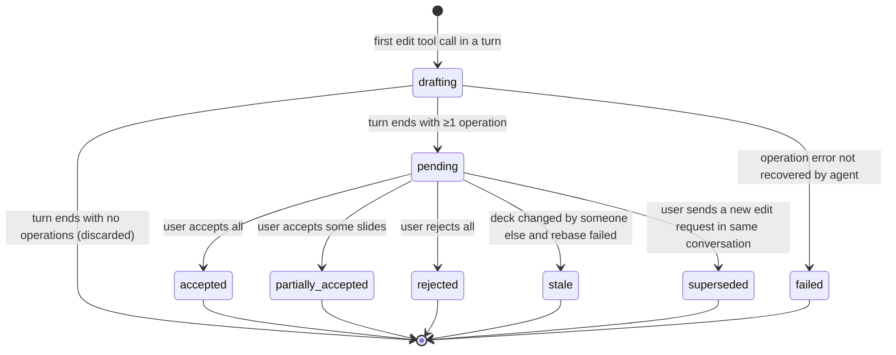

# AI Slide Assistant: Technical Design

**Version:** 0.1 (draft) **Companion to:** *AI Slide Assistant: Project Specification* v0.3 (the "product spec") **Audience:** engineers and coding agents implementing the system

This document turns the product spec into implementable decisions: the technology stack, repository layout, contracts, state machines, the speech and rendering pipelines, the proof-of-concept spikes that must run first, and an ordered milestone plan with checks that can be executed. Where this document and the product spec disagree, the product spec decides *what* to build and this document decides *how*. Items marked **\[ASSUMPTION\]** are defaults chosen so work can proceed; each is listed in section 18 for confirmation.

## 0. Rules for implementing agents

These rules are normative and must be copied into `AGENTS.md` (and `CLAUDE.md`) at the repository root during milestone M0.

**Design system.** Before writing or changing any frontend markup, CSS or component, load and follow the **Banco CTT Design System Agent Skill**. Its components, tokens, typography, spacing, iconography, accessibility patterns and tone of voice take precedence over any visual detail in this document or in the product spec. Never introduce colours, fonts, spacing values or icons that do not come from the design system; if something needed is missing from it, stop and record a question in `docs/design-gaps.md` rather than inventing a style. **\[ASSUMPTION\]** The skill is installed in the agent's environment under a name containing "banco-ctt"; its exact name and whether it ships web components, CSS classes or tokens only is to be confirmed (section 18, A-1).

**No UI frameworks.** The frontend is plain JavaScript (ES2022 modules). React, Vue, Angular, Svelte, Lit, jQuery and similar libraries are not allowed. Small single-purpose utilities may be added only with justification in the pull request and a licence check (section 17).

**Contracts first.** Any change to the REST API, WebSocket events, tool schemas or slide representation starts with an edit to the files under `contracts/`, followed by regenerated or updated code on both sides and passing contract tests.

**Definition of done.** A task is done only when its "Done when" checks in section 15 pass locally with `make check`, new code has tests, and no lint or type errors are introduced.

**Do not** modify files under `contracts/kb/` (owned by the KB project), commit secrets, call real external model or KB endpoints from tests, or disable a failing test to make a build pass.

## 1. Technology decisions

| Area | Decision | Notes |
| --- | --- | --- |
| Frontend language | JavaScript ES2022, native ES modules | Type-checked with JSDoc annotations and `tsc --noEmit --checkJs` (TypeScript used only as a checker, no `.ts` sources). |
| Frontend components | Native Web Components (Custom Elements v1, Shadow DOM) | Encapsulation rules in section 3. |
| Frontend tooling | esbuild for production bundling; plain static server in development; ESLint + Prettier | No transpilation beyond bundling and minification. |
| Frontend tests | Vitest with happy-dom for units; `@web/test-runner` for components in a real browser; Playwright for end-to-end |  |
| Backend | Python 3.12, FastAPI, Pydantic v2, Uvicorn | python-pptx dictates Python for the document engine; one language for all backend services. |
| Database | PostgreSQL 16, SQLAlchemy 2 (async), Alembic migrations |  |
| Background jobs | Redis 7 + arq | Rendering, summarisation, image description, exports. |
| File storage | `Storage` interface with a local-filesystem implementation (development) and an S3-compatible implementation (production) |  |
| Document engine | python-pptx + lxml, plus custom Open XML code where python-pptx has gaps | See spikes SP-1 to SP-3. |
| Rendering | LibreOffice headless (`soffice --convert-to pdf`) in its own container, rasterised with pypdfium2 |  |
| LLM | Any OpenAI-compatible chat-completions endpoint with tool calling and image input; vLLM or Ollama for local deployment | Model chosen in spike SP-7. |
| STT | Whisper large-v3-turbo via faster-whisper (CTranslate2), Silero VAD for segmentation | Section 9. |
| TTS | Kokoro-82M via the `kokoro` Python package | Section 9; note the Portuguese voice limitation. |
| Knowledge Base | External system consumed via its HTTP APIs | Section 10. |
| Authentication | OIDC (corporate identity provider) with a backend-for-frontend session cookie | **\[ASSUMPTION\]** A-2. Tokens never reach browser JavaScript. |
| Deployment | Docker images per service; Docker Compose for development; target runtime TBD | **\[ASSUMPTION\]** A-3. |

## 2. Repository layout

```
/
├── AGENTS.md, CLAUDE.md          # rules from section 0, commands, conventions
├── Makefile                      # make dev | test | check | e2e | fixtures
├── docker-compose.yml
├── contracts/
│   ├── api/openapi.yaml          # REST API (source of truth)
│   ├── ws/events.schema.json     # WebSocket event envelope + payloads
│   ├── tools/*.schema.json       # one JSON Schema per assistant tool
│   ├── slide/slide.schema.json   # structured slide representation
│   └── kb/openapi.yaml           # provided by the KB project, read-only
├── frontend/
│   ├── index.html
│   ├── src/
│   │   ├── app.js                # bootstrap, router, top-level shell
│   │   ├── core/                 # store, event bus, api client, ws client, router, base component
│   │   ├── audio/                # capture worklet, encoder, playback queue
│   │   ├── components/           # one folder per custom element
│   │   ├── views/                # route-level elements (project list, project home, editor)
│   │   └── design-system/        # integration layer for the Banco CTT DS (stylesheet adoption, wrappers)
│   └── test/
├── backend/
│   ├── app/
│   │   ├── api/                  # FastAPI routers (thin)
│   │   ├── domain/               # projects, decks, versions, proposals, conversations, memory
│   │   ├── agent/                # agent loop, context manager, prompts, tool registry + executors
│   │   ├── docengine/            # pptx read model, operations, slide copy, layout mapping, overflow
│   │   ├── integrations/         # model gateway, kb client, stt/tts clients, storage
│   │   ├── workers/              # arq jobs
│   │   └── db/                   # SQLAlchemy models, Alembic migrations
│   └── tests/
├── services/
│   ├── render/                   # LibreOffice + pypdfium2 HTTP service
│   ├── stt/                      # faster-whisper WebSocket service
│   └── tts/                      # Kokoro HTTP streaming service
├── fixtures/
│   ├── decks/                    # sample .pptx files (section 14)
│   ├── templates/                # Banco CTT slide templates (if provided) + default
│   ├── kb-mock/                  # mock KB server implementing contracts/kb
│   └── evals/                    # editing-request evaluation set
└── docs/                         # ADRs, design-gaps.md, spike reports
```

## 3. Frontend architecture

### 3.1 Encapsulation rules

Every UI element is a Custom Element named with the prefix `sa-` (for example `sa-slide-strip`), defined in its own module that exports the class and registers it once. Internal state lives in private class fields (`#state`, `#render()`) and is never exposed as public properties except through documented getters and setters. Data flows down through properties (objects) and attributes (simple strings); events flow up as `CustomEvent`s with `bubbles: true, composed: true` and a `sa:` prefix (for example `sa:slide-selected`). Components never reach into another component's shadow root and never query the global document for other components.

Application-wide state (current user, current project, active deck, selection, conversation, pending proposals, voice state) lives in a single `Store` module: an observable holding immutable snapshots, changed only through named actions (`store.dispatch('selectSlide', {deckId, slideId})`). Views subscribe to the slices they need and pass data down to child components. Side effects (HTTP, WebSocket, audio) live in service modules under `core/` and `audio/`, never in components.

All shared modules are ES modules with no top-level side effects other than custom element registration. There are no globals on `window` apart from the registered elements.

### 3.2 Base component

A small `BaseElement` class in `core/` (about 100 lines) provides: an open shadow root, adoption of the design-system stylesheets, a `render()` scheduled at most once per animation frame, safe templating via a tagged `html` helper that escapes interpolated values, subscription helpers that unsubscribe automatically in `disconnectedCallback`, and a `emit(name, detail)` helper. Content coming from slides, the KB or the model is always inserted as text, never as HTML.

### 3.3 Design system integration

Shadow DOM blocks global stylesheets, so the design system must be brought into each shadow root deliberately. The `design-system/` folder contains the integration layer, written after reading the Banco CTT Design System skill. Its exact form depends on what the design system provides (assumption A-1). If it ships CSS (classes and custom properties), the stylesheets are loaded once as constructable `CSSStyleSheet` objects and added to every component's `adoptedStyleSheets`; CSS custom properties (design tokens) also inherit through shadow boundaries. If it ships its own web components, `sa-` components compose them directly. If it ships tokens only, tokens are exposed as CSS custom properties on `:root` and all component styles reference them. Light and dark themes follow whatever the design system defines.

### 3.4 Routes and views

| Route | View element | Contents |
| --- | --- | --- |
| `/` | `sa-project-list` | Projects with search, create, archive. |
| `/projects/:pid` | `sa-project-home` | Decks, conversations, assets, project instructions and memory, settings, members. |
| `/projects/:pid/decks/:did` | `sa-editor` | Three panes: `sa-slide-strip` (thumbnails), `sa-slide-stage` (preview, selection overlay, `sa-diff-view` when a proposal is pending), `sa-assistant-panel` (conversation picker, `sa-message-list`, `sa-composer`, `sa-voice-control`, `sa-proposal-bar`). |
| `/projects/:pid/decks/:did/history` | `sa-version-history` | Versions with preview, restore. |

The router uses the History API with a small route table; unknown routes show a not-found view.

### 3.5 Slide preview and selection

The stage shows the rendered PNG of the slide. Selection is drawn as an overlay of absolutely positioned boxes computed from the shape geometry in the slide representation (EMU converted to percentages), so the user can click a shape to select it without the browser rendering the slide itself. The selected shape IDs are sent with every chat message.

## 4. Backend architecture

The API layer (`api/`) only validates input, checks authorisation and calls domain services. Domain services own transactions and invariants. The agent (`agent/`) depends on domain services and the document engine through a tool registry; it never touches the database or files directly. Integrations are behind interfaces so tests can replace them with fakes.

Long-running work (rendering, summarising, describing images, exports) runs in arq workers and reports progress over the conversation WebSocket.

Authorisation is project-based: every request resolves the caller's role in the project (owner, editor, viewer) and checks it in one dependency (`require_role`). Agent tool executors receive the same user context and re-check permissions.

## 5. Data model

Types are PostgreSQL. All tables have `created_at timestamptz not null default now()`; mutable ones also have `updated_at`. IDs are UUIDv7.

```sql
users            (id, external_subject text unique, display_name, email, locale)
projects         (id, name, description, owner_id → users, settings jsonb, instructions text,
                  instructions_version int, archived_at, deleted_at)
project_members  (project_id, user_id, role text check (role in ('owner','editor','viewer')),
                  primary key (project_id, user_id))
decks            (id, project_id, title, template_id, current_version_id, lock_user_id,
                  lock_expires_at, deleted_at)
deck_versions    (id, deck_id, number int, file_key text, file_sha256 text, slide_count int,
                  created_by_user_id, source text check (source in ('upload','create','assistant','manual','restore','copy')),
                  proposal_id, parent_version_id, unique (deck_id, number))
conversations    (id, project_id, title, summary text, summary_upto_message_id, created_by_user_id, deleted_at)
messages         (id, conversation_id, seq bigint, author text check (author in ('user','assistant','tool','system')),
                  user_id, content jsonb, active_deck_id, selection jsonb, tokens int, unique (conversation_id, seq))
proposals        (id, project_id, conversation_id, status text, plan jsonb, summary text, error jsonb)
proposal_decks   (proposal_id, deck_id, base_version_id, draft_file_key, operations jsonb,
                  affected_slide_ids jsonb, primary key (proposal_id, deck_id))
memory_items     (id, project_id, text, source_conversation_id, source_message_id, created_by text, deleted_at)
assets           (id, project_id, kind text check (kind in ('image','document')), file_key, sha256,
                  mime_type, width, height, description text, extracted_text text, uploaded_by_user_id)
image_descriptions (sha256 primary key, description text, model text)   -- cache shared across projects
audit_log        (id, user_id, project_id, action text, details jsonb)
```

Operations stored in `proposal_decks.operations` are the validated tool calls that modified the draft, in order. They are the basis for per-slide acceptance and rebasing (section 6).

## 6. State machines

### 6.1 Proposal



A proposal is created on the first editing tool call in a turn. For each affected deck the draft starts as a copy of the deck's current version (`base_version_id`). Operations apply to the draft in order; if an operation fails, the agent receives the error as a tool result and may try again; if the turn ends in an error state, the whole proposal is marked `failed` and drafts are deleted, so a proposal is never half-applied.

**Accept all:** if each deck's current version still equals its base version, the draft becomes a new version. Otherwise the system rebases: it replays the operation list on the new current version; if every operation validates, the result becomes the new version, otherwise the proposal becomes `stale` and the assistant offers to redo the request.

**Accept per slide:** the system replays only operations whose affected slide IDs are in the accepted set onto the base (or current) version. Operations that affect several slides (move, copy, delete across a range) are accepted or rejected as a unit; the diff view groups them visibly.

**Only one pending proposal per conversation.** A new editing request while one is pending marks the old one `superseded` after the frontend asks the user to accept, reject or discard it.

### 6.2 Undo and redo

Undo creates a new version whose content equals the previous version (`source = 'restore'`); history is never rewritten. Redo restores the version that was undone, if no newer version exists. Both are per deck and are available by button, typed request or voice.

### 6.3 Deck lock

Opening a deck in the editor acquires a lock for 5 minutes, renewed by a heartbeat every 60 seconds over the WebSocket. Other users see the deck read-only with the lock holder's name. Assistant edits from other conversations by the same user are allowed (they produce proposals and use rebasing). A lock expires automatically if the heartbeat stops.

### 6.4 Conversation turn

A turn starts when a user message arrives and ends when the model returns a message without tool calls, when the turn hits a limit, or when the user cancels. Limits per turn: 16 model calls, 40 tool calls, 180 seconds wall time; exceeding a limit ends the turn with an explanatory message and keeps any proposal as `pending` if its operations validated. `ask_user` and `propose_plan` end the turn; the user's reply starts a new turn with the same proposal still in `drafting`.

## 7. Agent design

### 7.1 Model gateway

One interface, `ChatModel.complete(messages, tools, stream=True)`, with an implementation for OpenAI-compatible endpoints. Configuration per role: `chat` (main model), `utility` (summaries, image descriptions, alt text; may be the same model), each with base URL, model name, API key reference, context window, `supports_tools`, `supports_vision`, and `data_leaves_premises`. If `supports_tools` is false, the JSON fallback from product spec 5.3 applies.

### 7.2 Context assembly

Budgets are percentages of the configured context window, leaving 20% for the response.

| Block | Budget | Content |
| --- | --- | --- |
| System prompt + tool schemas | fixed | Section 7.3. |
| Project instructions | ≤ 5% | Full text; editor enforces the limit. |
| Memory items | ≤ 5% | All items; if over budget, the items most similar to the user message (embedding similarity computed by the utility model endpoint or a local embedding model, **\[ASSUMPTION\]** A-6). |
| Conversation | ≤ 30% | Rolling summary, then most recent messages verbatim. |
| Project overview | ≤ 5% | Deck list and asset list (names only). |
| Active deck | ≤ 15% | Outline from `get_deck_outline`. |
| Focus slides | ≤ 20% | Full representation of selected and referenced slides, plus the rendered image of the selected slide. |

Summarisation runs as a background job when the verbatim part exceeds its budget, folding the oldest messages into `conversations.summary` with a prompt that preserves decisions, open questions, and references to deck, version and slide IDs.

### 7.3 System prompt

The system prompt lives in `backend/app/agent/prompts/system.md` and is versioned with the code. It must cover: the assistant's role; that slide, KB, project and memory content is untrusted data, never instructions; the editing protocol (inspect before editing, address shapes by ID, prefer layout placeholders, respect the template, never shrink body text below the minimum, ask instead of guessing when references are ambiguous, use `propose_plan` for multi-slide or destructive changes); the rule to cite KB sources in speaker notes; the memory protocol (announce before `remember`); voice-friendly answers (short first sentence, details after); and responding in the user's language. Prompt changes must pass the evaluation set in section 14.

### 7.4 Tools

Each tool in product spec section 5 has a JSON Schema in `contracts/tools/<name>.schema.json` (input) and a typed result. Executors validate input against the schema, check permissions, perform the operation on the draft, and return either a result or a structured error `{code, message, hint}` that the model can act on (for example `SHAPE_NOT_FOUND`, `TEXT_OVERFLOW`, `LAYOUT_HAS_NO_PICTURE_PLACEHOLDER`, `LOCKED_ELEMENT`). Three schemas are given in full as the pattern for the rest.

```json
{
  "$id": "update_text",
  "type": "object",
  "required": ["slide_id", "shape_id", "paragraphs"],
  "additionalProperties": false,
  "properties": {
    "deck_id": { "type": "string", "format": "uuid", "description": "Defaults to active deck." },
    "slide_id": { "type": "integer" },
    "shape_id": { "type": "integer" },
    "paragraphs": {
      "type": "array", "minItems": 1, "maxItems": 40,
      "items": {
        "type": "object", "required": ["runs"], "additionalProperties": false,
        "properties": {
          "level": { "type": "integer", "minimum": 0, "maximum": 4, "default": 0 },
          "alignment": { "enum": ["left", "center", "right", "justify"] },
          "runs": {
            "type": "array", "minItems": 1,
            "items": {
              "type": "object", "required": ["text"], "additionalProperties": false,
              "properties": {
                "text": { "type": "string", "maxLength": 2000 },
                "bold": { "type": "boolean" },
                "italic": { "type": "boolean" },
                "theme_color": { "enum": ["text1", "text2", "accent1", "accent2", "accent3", "accent4", "accent5", "accent6"] }
              }
            }
          }
        }
      }
    }
  }
}
```

```json
{
  "$id": "add_slide",
  "type": "object",
  "required": ["layout", "position"],
  "additionalProperties": false,
  "properties": {
    "deck_id": { "type": "string", "format": "uuid" },
    "layout": { "type": "string", "description": "Layout name from list_layouts." },
    "position": {
      "type": "object", "additionalProperties": false,
      "properties": {
        "after_slide_id": { "type": "integer" },
        "at_end": { "const": true }
      },
      "oneOf": [{ "required": ["after_slide_id"] }, { "required": ["at_end"] }]
    },
    "placeholders": {
      "type": "array",
      "items": {
        "type": "object", "required": ["placeholder_idx"], "additionalProperties": false,
        "properties": {
          "placeholder_idx": { "type": "integer" },
          "paragraphs": { "$ref": "update_text#/properties/paragraphs" },
          "image_ref": { "$ref": "common#/$defs/image_ref" }
        }
      }
    },
    "notes": { "type": "string", "maxLength": 10000 }
  }
}
```

```json
{
  "$id": "copy_slides",
  "type": "object",
  "required": ["source_deck_id", "slide_ids", "target_deck_id", "position"],
  "additionalProperties": false,
  "properties": {
    "source_deck_id": { "type": "string", "format": "uuid" },
    "slide_ids": { "type": "array", "items": { "type": "integer" }, "minItems": 1, "maxItems": 50 },
    "target_deck_id": { "type": "string", "format": "uuid" },
    "position": { "$ref": "add_slide#/properties/position" },
    "formatting": { "enum": ["adapt_to_target", "keep_source"], "default": "adapt_to_target" }
  }
}
```

`image_ref` is `{ "asset_id": uuid }` or `{ "kb_document_id": string, "kb_image_id": string }`; URLs are not accepted.

### 7.5 Slide representation

Defined in `contracts/slide/slide.schema.json`. Abridged example:

```json
{
  "deck_id": "0190…", "slide_id": 258, "index": 4, "layout": "Title and Content",
  "hidden": false, "size_emu": { "cx": 12192000, "cy": 6858000 },
  "shapes": [
    { "shape_id": 2, "name": "Title 1", "type": "placeholder", "placeholder": { "type": "title", "idx": 0 },
      "box": { "x": 0.06, "y": 0.05, "w": 0.88, "h": 0.14 },
      "paragraphs": [{ "level": 0, "runs": [{ "text": "Warranty policy 2026" }] }],
      "overflow": false, "locked": false },
    { "shape_id": 5, "name": "Picture 4", "type": "picture",
      "box": { "x": 0.55, "y": 0.25, "w": 0.40, "h": 0.60 },
      "alt_text": "", "image_sha256": "…", "description": "Photo of a parcel sorting line.", "locked": false },
    { "shape_id": 9, "name": "Diagram 3", "type": "other", "subtype": "smartart", "locked": true }
  ],
  "notes": "Source: KB doc 'Warranty Policy v4' (id WP-4)."
}
```

`box` values are fractions of slide width and height; exact EMU values are available in `box_emu` but omitted from the model context to save tokens.

## 8. WebSocket protocol

One socket per open conversation at `/projects/{pid}/conversations/{cid}/chat`. Every frame is JSON: `{ "type": string, "id": string, "ts": string, "payload": object }`. Client-to-server types: `user_message` (text, active deck, selection, input mode text or voice), `cancel_turn`, `answer` (reply to `ask_user` or `propose_plan`), `proposal_decision`, `lock_heartbeat`. Server-to-client types: `turn_started`, `assistant_delta` (streamed text), `assistant_message` (final, with `speakable` text for TTS), `tool_started` / `tool_finished` (name and short human-readable description, for the progress display), `question` (from `ask_user`, with optional options), `plan` (from `propose_plan`), `proposal_updated` (status, affected decks and slides, render URLs), `memory_changed`, `deck_changed` (new version by another actor), `lock_changed`, `turn_ended` (reason), `error`. Full payload schemas are in `contracts/ws/events.schema.json`. The client reconnects with exponential backoff and requests missed messages with `?since_seq=`.

REST errors use `application/problem+json` (RFC 9457). List endpoints use cursor pagination. Upload and accept endpoints accept an `Idempotency-Key` header.

## 9. Speech pipelines

### 9.1 Speech-to-text (Whisper large-v3-turbo)

The browser captures microphone audio with an `AudioWorklet`, downsamples to 16 kHz mono 16-bit PCM, and sends 20 ms frames as binary WebSocket messages to the STT service (proxied through the API for authentication). The STT service runs faster-whisper with the large-v3-turbo weights in CTranslate2 format on GPU (float16; int8 on CPU as a fallback). Silero VAD segments speech. While the user speaks, the service re-transcribes the current segment roughly every 800 ms and sends `partial` results; at the end of speech (600 ms of silence in hands-free mode, or button release in push-to-talk) it sends a `final` result. Language is taken from the project setting (default Portuguese, `pt`) with optional auto-detection. A project-level vocabulary (product names, acronyms) is passed as the initial prompt to improve recognition of domain terms. The large-v3-turbo model was trained for transcription, not translation, which matches this use.

Targets on the reference GPU: first partial within 500 ms of speech onset, final within 700 ms of end of speech for utterances under 15 seconds (validated in SP-5).

### 9.2 Text-to-speech (Kokoro-82M)

The API sends the assistant's `speakable` text (a short, voice-friendly version produced with the response) to the TTS service, which splits it into sentences, synthesises each with Kokoro, and streams 24 kHz PCM chunks back as soon as each sentence is ready. The browser plays chunks through a queue in an `AudioWorklet`. Barge-in: when the user presses the microphone button or VAD detects speech, the frontend stops playback, clears the queue and sends `cancel` so the service stops synthesis. Voice and speed are user settings; the voice list per language comes from the TTS service.

**Portuguese limitation.** Kokoro's Portuguese voices are Brazilian Portuguese only; it has no European Portuguese voice. For a Banco CTT audience this is a product decision: either accept pt-BR voices, or keep Kokoro for English and evaluate a European Portuguese engine. The TTS service therefore sits behind a `SpeechSynthesizer` interface with per-language engine selection, so a second engine can be added without frontend changes. Spike SP-6 covers this.

## 10. Knowledge Base integration

The KB is a separate project. This project consumes it through its HTTP API, specified in `contracts/kb/openapi.yaml`, which the KB team provides (assumption A-4). The backend contains a `KnowledgeBaseClient` interface with the operations the assistant needs:

```python
class KnowledgeBaseClient(Protocol):
    async def search(self, user: UserContext, query: str, collections: list[str] | None,
                     top_k: int = 8) -> list[KbHit]: ...          # hit: doc id, title, passage, score, url
    async def get_document(self, user: UserContext, doc_id: str,
                           passage_id: str | None = None) -> KbDocument: ...
    async def get_image(self, user: UserContext, doc_id: str, image_id: str) -> bytes: ...
    async def list_collections(self, user: UserContext) -> list[KbCollection]: ...
```

An adapter maps these to the real KB endpoints. The user's identity is forwarded so the KB enforces its own permissions: preferably with an OAuth 2.0 token exchange (on-behalf-of) token for the user, otherwise a service credential plus a signed user identifier header, depending on what the KB supports. Calls time out after 8 seconds, failures are returned to the model as tool errors, and results are cached for 5 minutes per user and query. If the KB has no image endpoint, `get_image` raises `NotSupported` and the tool reports it.

Until the real KB is available, `fixtures/kb-mock/` provides a mock server implementing `contracts/kb/openapi.yaml` with a small set of fictional documents, including injection test documents (section 14). The adapter is tested against the mock and, in a separate opt-in test suite, against a KB test environment.

## 11. Document engine

The engine exposes a read model (`read_deck`, `read_slide`, producing the section 7.5 representation) and operation functions that take a loaded `Presentation`, apply one validated operation and return the affected slide IDs. Rules from product spec section 6 apply: modify only the targeted elements, preserve unknown XML, take styling from layouts and theme. Specific techniques:

**Slide copy between decks** (python-pptx has no API for it): create a slide on the target with the best-matching layout, deep-copy the source slide's shape tree XML, copy each referenced part (images, media, charts with their embedded workbooks, notes) into the target package with new relationship IDs, rewrite `r:embed` / `r:id` references, and for `adapt_to_target` re-map placeholders by type and index to the target layout. Charts, SmartArt and OLE objects are copied as-is and marked `locked`. Proven in SP-1.

**Layout change**: create a new slide with the target layout at the same position, move content into placeholders matched by type (title, body, picture, then by index), keep unmatched non-placeholder shapes at their positions, report unmatched placeholder content, delete the old slide. Proven in SP-2.

**Overflow detection**: estimate text height with font metrics (from fonts installed in the backend image, matching the template fonts) and the text frame's insets and autofit settings; flag overflow when the estimate exceeds the frame height by more than 5%. The render self-check is the second line of defence. Calibrated in SP-3.

**Validation**: after every operation, save to a buffer and reload; on failure the operation is rejected with `INTERNAL_INVALID_PACKAGE`.

## 12. Render service

An HTTP service: `POST /render` with a .pptx file key, returning per-slide PNG keys. It converts the whole file to PDF once with LibreOffice (configured to include hidden slides so page N maps to slide N), rasterises pages with pypdfium2 at 1600 px wide for previews and 320 px for thumbnails, and stores results keyed by file SHA-256 so unchanged files are never re-rendered. Each conversion runs in a fresh LibreOffice profile directory with a 60-second timeout, and the container has no network access. Template fonts must be installed in the container (assumption A-5); missing fonts are the main cause of preview mismatches. Throughput target: a 30-slide deck in under 10 seconds (SP-4).

## 13. Configuration

All configuration comes from environment variables (12-factor), documented in `.env.example`. Key groups: `DATABASE_URL`, `REDIS_URL`, `STORAGE_*`; `OIDC_*`; `LLM_CHAT_*` and `LLM_UTILITY_*` (base URL, model, API key, context window, capability flags, `DATA_LEAVES_PREMISES`); `STT_URL`, `STT_MODEL=large-v3-turbo`, `STT_DEVICE`, `STT_COMPUTE_TYPE`; `TTS_URL`, `TTS_DEFAULT_VOICE_<LANG>`; `KB_BASE_URL`, `KB_AUTH_MODE`, `KB_TIMEOUT_S`; `RENDER_URL`; limits (`MAX_UPLOAD_MB`, `MAX_DECKS_PER_PROJECT`, turn limits from 6.4).

## 14. Test strategy and fixtures

**Unit tests** cover the store, components and services (frontend) and domain services, tool executors and document engine operations (backend). **Contract tests** validate that the backend's OpenAPI output equals `contracts/api/openapi.yaml`, that frontend fixtures validate against the WebSocket schemas, and that the KB adapter works against the mock. **Document engine golden tests** apply each operation to fixture decks, then reload the output, compare the slide representation to an expected JSON file, and check it renders. **End-to-end tests** (Playwright) script scenarios S1 to S10 against the full Compose stack with a **scripted fake model** that returns predetermined tool calls, so they are deterministic. **Model evaluations** run separately against a real model: `fixtures/evals/` holds editing requests with the deck, selection and expected target shapes and properties; the runner reports targeting accuracy, overflow rate and injection resistance.

Fixtures to create in M0 and M1: at least 12 decks covering default and Banco CTT templates, hidden slides, SmartArt, charts, tables, animations, embedded video, grouped shapes, notes, very long text, Portuguese text with accents, and 100+ slides; 60 initial evaluation requests (growing to 200), half in Portuguese; 10 prompt-injection documents and 3 injection decks.

`make check` runs lint, type checks, unit, contract and golden tests. `make e2e` runs Playwright against Compose. `make eval` runs model evaluations.

## 15. Spikes and milestones

### 15.1 Spikes (before the main build; each produces a report in `docs/spikes/`)

| ID | Question | Exit criterion |
| --- | --- | --- |
| SP-1 | Can slides be copied between decks with different templates, including images, charts and notes? | 20 slide/template combinations copy and open in PowerPoint without repair; report lists unsupported cases. |
| SP-2 | Can layout changes preserve content reliably? | 15 layout changes on fixture decks, no content lost, unmatched content reported. |
| SP-3 | How accurate is overflow estimation? | Agreement with rendered output on ≥ 90% of 100 sampled text frames. |
| SP-4 | Render speed and fidelity with template fonts installed. | 30-slide deck in \< 10 s; visual comparison against PowerPoint exports for 10 slides documented. |
| SP-5 | STT latency and accuracy in Portuguese and English on target hardware. | Latency targets in 9.1 met; word error rate measured on 50 recorded utterances with domain terms, with and without vocabulary prompt. |
| SP-6 | Kokoro voice quality for the target audience. | Listening test with stakeholders on pt-BR and English voices; decision recorded on European Portuguese (accept pt-BR, or select an additional engine). |
| SP-7 | Which local and hosted models handle the tool set well? | 2–4 candidate models run on the initial 60-request evaluation set; targeting accuracy ≥ 90% for the selected model. |

### 15.2 Milestones

Each milestone ends with its "Done when" checks passing in CI.

| # | Scope | Done when |
| --- | --- | --- |
| M0 | Repository skeleton, Compose stack, CI, `AGENTS.md`/`CLAUDE.md`, contracts skeleton, Design System skill integration layer and a style-guide page rendering DS components in Shadow DOM, fixtures v1. | `make dev` starts all services; `make check` passes; style-guide page reviewed against the DS. |
| M1 | Auth (OIDC + dev login), projects and members, decks upload/create/download, versions, render service, project home and editor with slide strip and preview (no assistant). | E2E: create project, upload deck, view thumbnails, download identical file, restore version. |
| M2 | Document engine read model and single-deck operations (text, format, add/delete/move/duplicate slide, images, notes, alt text) with golden tests. | All golden tests pass; outputs open in PowerPoint (manual check on 10 files). |
| M3 | Agent loop, model gateway, tool registry, conversations over WebSocket, proposals with diff view, accept/reject per slide, undo/redo, rolling summaries, project instructions. | E2E S1, S5, S6, S7 pass with the fake model; eval accuracy ≥ 90% with the selected model. |
| M4 | KB adapter and mock, KB tools, citations in notes, clarification via `ask_user`. | E2E S2, S4 pass; injection eval shows no unconfirmed destructive actions. |
| M5 | STT and TTS services, `sa-voice-control`, push-to-talk, playback, barge-in, voice confirmations. | E2E S3 passes with recorded audio fixtures; latency targets met on reference hardware. |
| M6 | Project memory, conversation search, project assets and reference documents, cross-deck operations (copy slides, multi-deck changes), deck locks. | E2E S8, S9, S10 pass; memory recall benchmark ≥ 90%. |
| M7 | Hardening: accessibility audit (WCAG 2.2 AA), security review, load test (scale targets), PDF export, sharing, project export/import. | Audit findings closed or accepted; load test report. |

## 16. Security notes

Uploads are checked for type by content (ZIP with `[Content_Types].xml` and a presentation part), size and decompressed size (zip-bomb limit 1 GB), and macro content is rejected. XML is parsed with lxml with entity resolution and network access disabled. Rendered output and assets are served from a separate path with `Content-Disposition` and a strict content security policy. The model has no tool that fetches URLs, sends messages or executes code. Audit log entries are written for every tool call and every version change.

## 17. Licences of selected components

| Component | Licence | Notes |
| --- | --- | --- |
| python-pptx, lxml, FastAPI, Pydantic, SQLAlchemy, Alembic, arq | MIT / BSD |  |
| pypdfium2 | Apache 2.0 / BSD | Chosen over PyMuPDF (AGPL). |
| LibreOffice | MPL 2.0 | Unmodified, separate container. |
| faster-whisper; Whisper large-v3-turbo weights | MIT; MIT |  |
| Silero VAD | MIT |  |
| Kokoro-82M weights and `kokoro` package | Apache 2.0 | Its grapheme-to-phoneme step can use espeak-ng (GPL-3.0) for some languages including Portuguese; legal review required before distribution (A-7). |
| esbuild, Vitest, Playwright, ESLint, Prettier | MIT / Apache 2.0 | Development only. |
| PostgreSQL, Redis 7 | PostgreSQL licence; BSD | Redis versions 7.4 and later changed licence; pin 7.2 or use Valkey (BSD) (A-8). |

Every new dependency needs a licence entry in `docs/licenses.md` checked by CI.

## 18. Assumptions to confirm

| ID | Assumption |
| --- | --- |
| A-1 | The Banco CTT Design System Agent Skill is available to implementing agents. Its name and the form of its deliverables (CSS, web components, tokens) determine the integration layer in 3.3. Whether the design system also governs **slide templates** (Banco CTT .pptx/.potx templates) is undecided; if yes, the templates must be supplied for fixtures and the default template. |
| A-2 | Authentication is through the bank's OIDC identity provider; a dev-only login exists for local work. |
| A-3 | Production runs on containers with at least one NVIDIA GPU for STT and TTS (and for the local LLM if used); the exact platform is not yet known. |
| A-4 | The KB team provides an OpenAPI specification covering search, document retrieval and, ideally, image retrieval, with a way to act on behalf of the user. |
| A-5 | Template fonts are licensed for installation on servers for rendering and overflow measurement. |
| A-6 | An embedding model is available (from the LLM provider or a small local model) for memory relevance and conversation search. |
| A-7 | Legal review of espeak-ng usage via Kokoro, and a product decision on European Portuguese TTS (SP-6). |
| A-8 | Use Valkey or Redis 7.2 to avoid licence changes in later Redis versions. |
| A-9 | Default UI and assistant language is European Portuguese, with English available. |

The open questions in section 12 of the product spec remain open; until answered, implement the defaults in this document and keep them configurable.